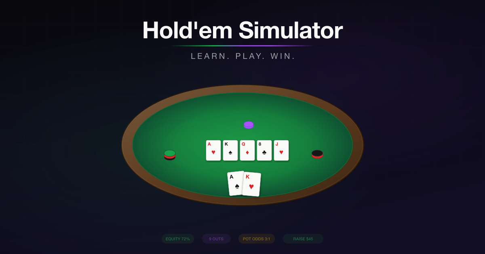

# No Limit Hold'em Simulator



A browser-based No-Limit Texas Hold'em poker simulator with 27 intelligent bot opponents (including 20 pro-inspired personas), real-time hand analysis, live text commentary, and comprehensive cross-session stats. Built for learning poker strategy through practice, observation, and hand replay. Three rounds of professional poker audits with 21 realism fixes. River polarization, MDF defense, pre-computed ranges, hero bet-sizing exploitation.

### Bot AI (16 realism fixes from professional audit)
- **Card-aware decisions** -- bots evaluate actual hole cards and board texture, not random probabilities
- **Chen+ scoring** -- position- and style-adjusted hand strength (classic Chen also shown for reference)
- **Board texture analysis** -- dry/wet, ace-high, paired, monotone — affects c-bet rates, barrel frequency, bluff sizing
- **Kicker-aware hand strength** -- top pair ace kicker plays aggressively (0.48); top pair deuce kicker plays cautiously (0.38)
- **SPR awareness** -- shallow stacks commit faster, deep stacks play positionally
- **Check-raises** -- bots trap with strong hands and raise when bet into, frequency varies by board texture
- **Position-aware 3-betting** -- 3.5x OOP, 3.0x IP, with aggression scaling
- **Street-aware barreling** -- turn card analysis (high cards = barrel, flush-completing = slow down), river scare card awareness
- **Preflop escalation** -- full 3-bet/4-bet/5-bet logic with per-persona frequencies
- **Short-stack push/fold** -- position-aware shove ranges (25-35% from BTN, 18-28% from EP)
- **Blocker-adjusted draws** -- flush draws discounted 5%, OESD 10%, gutshot 18%
- **Hero adaptation** -- bots adjust to your play style over a rolling 10-hand window
- **Table Flow** -- bots adjust when a player is dominating or running cold (20-hand rolling window)
- **River polarization** -- bots only bet monsters (value) and air (bluffs) on the river. Medium hands check. Core GTO concept.
- **Pre-computed opening ranges** -- uses the ranked 169-hand EV list with position shifts, not just Chen+ approximation
- **Minimum Defense Frequency (MDF)** -- bots defend enough of their range to prevent exploitable over-folding to large bets
- **Hero bet-sizing exploitation** -- bots detect if you bet big with value and small with bluffs (or vice versa), then adjust
- **Per-persona tilt** -- Phellmuth tilts after 1 loss; Pvey needs 10+ consecutive losses
- **Consistency system** -- bots occasionally misplay (1-12% depending on persona)
- **25 bot personas** (7 fictional + 18 pro) with VPIP/PFR/aggression/bluff/tilt/consistency profiles

### Real-Time Analysis
- **Expected Value (EV)** -- live +EV/-EV display when facing a bet, with pot odds integration
- **Monte Carlo equity engine** -- 500-800 adaptive iterations against opponent ranges
- **Pot odds** -- side-by-side percentage comparison (Your Equity vs Need), with pass/fail verdict
- **Real-time outs and draws** -- flush, OESD, gutshot, overcards, full house, trips draws with exact hit probability
- **Authentic 6-max ranges** -- 169 hands ranked by EV, position-aware from UTG (15%) to BTN (42%)
- **Opponent HUD** -- live VPIP, PFR, Aggression Factor, WTSD with strategic reads
- **Action recommendation** -- FOLD/CHECK/CALL/RAISE pinned at top of stats panel, always visible

### Live Text Commentary
- **Two simultaneous modes** -- Hero POV (first-person, your cards only) and TV Broadcast (Chorman Nad & Mon LeEachern style dual-voice — homage to the real Norman Chad & Lon McEachern)
- **TV mode shows all cards face-up** -- like watching WSOP on TV, hero still has full agency
- **400+ unique Chorman Nad quips** -- ex-wife jokes, self-deprecating humor, poker puns, persona-specific references (Gaplan/Sweathogs, Phellmuth/tantrums, Twan/durrrr)
- **Self-aware moments** -- Chorman knows he's commentating a simulation with bots
- **Mon/Chorman voice sliders** -- dial analysis depth and quip frequency independently
- Text only, no audio

### Tools & Export
- **Full hand evaluator** -- all 9 ranks, wheel/steel wheel detection, kicker tie-breaking
- **Fisher-Yates shuffle** with chi-squared verified uniformity across 10,000 deals
- **PokerStars hand history export** -- compatible with PokerTracker, Hold'em Manager, Equilab
- **Hand replay** -- re-live any hand with different decisions, compare outcomes
- **Hand detail modal** -- click any hand for PokerStars history, copy to clipboard, replay, analyze
- **Supabase persistence** -- cross-session lifetime stats with GitHub or email auth (optional)

## Table of Contents

- [Features](#features) -- poker table, hand analysis, ranges, HUD, betting, bot configurator, tilt, consistency, sessions, replay, stats
- [How Bot Behavior Works](#how-bot-behavior-works) -- persona config fields, Chen+, board texture, table flow, hero adaptation, preflop/postflop decision flows
- [Bot Simulation Script](#bot-simulation-script) -- headless bot-vs-bot simulation for analysis and tuning
- [Tech Stack](#tech-stack)
- [Getting Started](#getting-started)
- [Project Structure](#project-structure)
- [Configuration](#configuration)
- [Test Suites](#test-suites) -- 737 tests across 16 files
- [Poker Glossary](#poker-glossary)
- [Security](#security) -- audit results, defense-in-depth, CSP headers, credential validation
- [Roadmap](#roadmap)
- [Future Enhancements](#future-enhancements)

## Features

### Poker Table
- 2-8 player tables with proper seat layout and position badges (UTG, MP, CO, BTN, SB, BB)
- Casino-dark aesthetic: emerald felt, walnut rail, gold accents
- Cards with CSS 3D flip animations
- Click any opponent's cards to peek at their hand (learning tool)
- Light/dark mode (table felt stays emerald green in both)

### Real-Time Hand Analysis
- **Hand strength**: Chen score + Chen+ (position/style-adjusted), preflop tier (Premium/Strong/Playable/Marginal/Trash), contextual hand descriptions ("Top Pair, Ace-kicker", "Nut Flush Draw")
- **Equity**: Monte Carlo simulation (300 iterations, adaptive to 500 in close spots) against random opponent ranges
- **Hand improvement probabilities**: Per-rank % chance of making each hand by the river (e.g., "Flush: 19.2%", "Two Pair: 32.4%")
- **Draws and outs**: Flush draws, straight draws (OESD/gutshot), overcards, set draws with hit probability by next card and by river
- **Pot odds**: Side-by-side percentage comparison (Your Equity vs Need), with ratio shown as secondary reference, pass/fail verdict
- **Expected Value (EV)**: `(equity x pot) - call cost` -- green for +EV (profitable call), red for -EV
- **SPR**: Stack-to-Pot Ratio with strategic guidance (low/medium/high SPR advice)
- **Rule of 2/4**: Quick mental math reference alongside exact calculations
- **Action recommendation**: FOLD / CHECK / CALL / RAISE with position-aware reasoning per street. Color-coded: green (confident), yellow (marginal), red (fold). Pinned at top of stats panel so it's always visible without scrolling.

### Hand Ranges
- Authentic 6-max cash game opening ranges by position (UTG 15% through BTN 42%)
- All 169 starting hands ranked by expected value
- Expandable lists categorized by pairs, suited, and offsuit hands
- In-range indicator showing whether your current hand falls within each range
- Facing-aggression ranges: 3-bet (8%), call-vs-3-bet (12%), 4-bet (3.5%), 5-bet (1.5%)

### Opponent Stats (HUD)
- Per-player stats: VPIP, PFR, Aggression Factor, Went-to-Showdown %
- Player type labels: Nit, Tight, Solid, Loose, Very Loose
- Aggression labels: Passive, Balanced, Aggressive, Hyper-aggressive
- Strategic reads: "Nit -- 3-bet liberally, steal their blinds", "Calling station -- don't bluff, value bet thin"

### Betting Controls
- Fold / Check / Call buttons with live amounts and tooltips
- Raise presets: 1/4 pot, 1/2 pot, 3/4 pot, pot, all-in (click to raise instantly)
- Presets below min-raise are dimmed and disabled with tooltip explanation
- Continuous slider from min-raise to all-in (steps by BB) with min-raise indicator
- Custom exact-amount input with keyboard enter support
- All amounts clamped: never below min-raise, never above your stack
- Prominent bankroll display with running P&L and +/- from starting stack
- **Pre-action queuing**: "Pre-fold" and "Pre-check/call" buttons while bots are acting. Cancel anytime before your turn.

### Bot Configurator

The setup screen shows your full table roster with inline controls. Each bot can use a named persona, a quick-select preset, or fully custom stats.

**7 Fictional Personas** -- each with a distinct playstyle and exploitable leak:

| Persona | VPIP | PFR | Aggression | Consistency | Leak |
|---------|------|-----|------------|-------------|------|
| Tight Tony | 14% | 11% | 0.85 | 95% | Folds too much to 3-bets, won't bluff rivers |
| Loose Lucy | 38% | 22% | 1.10 | 92% | Plays too many hands, especially suited junk |
| Aggressive Alex | 26% | 22% | 1.40 | 93% | Over-bets draws, 3-bets too wide |
| Calling Carl | 30% | 12% | 0.60 | 90% | Calls too much postflop, rarely raises |
| Tricky Tina | 24% | 18% | 1.15 | 94% | Slow-plays big hands, check-raises too often |
| Solid Sam | 22% | 17% | 1.00 | 97% | Nearly GTO -- the toughest fictional bot |
| Wild Wendy | 34% | 28% | 1.50 | 88% | Massive over-aggression, 25% bluff frequency |

**18 Pro Player Bots** -- modeled after real-world poker legends with per-persona tilt and consistency:

| Pro | VPIP | Style | Tilt | Consistency |
|-----|------|-------|------|-------------|
| Hill Phellmuth | 20% | Near-GTO, massive tilt after losses | 2.5x | 96% |
| Naniel Degreanu | 32% | Suited connectors from any position, creative | 0.5x | 96% |
| Ihil Pvey | 23% | Near-perfect, rare mistakes, almost untiltable | 0.3x | 99% |
| Boyle Drunson | 28% | Power poker, traps with monsters | 0.4x | 96% |
| Tennifer Jilly | 30% | Unpredictable tight/loose mix | 0.7x | 91% |
| Lhil Paak | 27% | Unorthodox, analytical, float bets | 0.6x | 93% |
| Entonio Asfandiari | 29% | Charismatic aggressor, constant pressure | 0.9x | 94% |
| Kabe Gaplan | 26% | Steady, intelligent, solid fundamentals | 0.8x | 95% |
| Bean-Robert Jellande | 36% | Fearless gambler, huge bluffs | 1.4x | 90% |
| Mike the Mouth | 28% | Solid until tilt -- then reckless all-ins | 2.2x | 91% |
| Mhris Coneymaker | 30% | Online grinder, occasional overplays | 1.1x | 92% |
| Rhip Ceese | 24% | Legendary, near-zero leaks, ice cold | 0.3x | 98% |
| Utu Sngar | 26% | Genius reads, fearless, erratic brilliance | 1.0x | 93% |
| Sanessa Velbst | 25% | Fearless aggressor, relentless 3-bets | 0.8x | 95% |
| Serik Eidel | 21% | Quiet assassin, tight, patient, untiltable | 0.3x | 98% |
| Dom Twan | 31% | "durrrr" hyper-LAG, massive bluffs | 0.5x | 95% |
| Aatrik Pantonius | 24% | Finnish ice, calm, precise | 0.4x | 97% |
| Ncotty Sguyen | 30% | Loose-aggressive with flair, tilts on bad beats | 1.2x | 91% |
| Cohnny Jhan | 22% | Old-school TAG, traps, patient, consistent | 0.5x | 97% |
| Krynn Benney | 25% | Modern GTO high-roller, creative lines | 0.6x | 95% |

**How pro stats are derived:** The 18 pro persona stats are hand-crafted archetypes, not pulled from a PokerTracker or HendonMob database. Each profile is built from publicly known playstyle characteristics -- interviews, televised hands, training content, and community consensus about how these players approach the game. VPIP/PFR values reflect the player's documented tight-or-loose tendencies (e.g., a known LAG gets 30%+ VPIP, a known nit gets sub-22%). Aggression, bluff frequency, and tilt multipliers are tuned to match the player's public reputation (e.g., a famously tilt-prone player gets a high tilt multiplier; a "poker robot" gets near-zero). Consistency values reflect perceived technical precision. The goal is _recognizable playstyle archetypes_ for learning, not exact replication of real-world database stats. All pro persona names use swapped initials to avoid identity appropriation.

**Table composition:**
- **Pro count selector**: 0 / 1 / 2 / 3 / All pros per table (default 2)
- **Shuffle Players** button to randomize the mix (click repeatedly)
- **Inline swap dropdown** on each seat to pick any persona
- **PRO badge** on pro bots, VPIP and aggression stats at a glance
- No duplicate personas at a table

**6 Quick-Select Presets** for instant archetype assignment:

| Preset | VPIP | PFR | Aggression | Style |
|--------|------|-----|------------|-------|
| Nit | 12% | 9% | 0.70 | Ultra-tight, folds everything marginal |
| Tight | 18% | 14% | 0.90 | Solid, conservative, few leaks |
| TAG | 22% | 18% | 1.20 | The winning style -- selective but aggressive |
| LAG | 30% | 24% | 1.40 | Wide range, lots of pressure |
| Loose-Passive | 35% | 14% | 0.50 | Calls everything, rarely raises |
| Maniac | 40% | 32% | 1.60 | Plays almost every hand, maximum aggression |

**Custom Sliders** -- tweak any individual stat per bot:

| Stat | Range | What it controls |
|------|-------|------------------|
| VPIP | 10-50% | How many hands the bot plays (tight vs loose) |
| PFR | 5-40% | How often it raises preflop (passive vs aggressive) |
| Aggression | 0.3-2.0 | Multiplier on postflop bets and raises |
| Bluff Frequency | 3-30% | How often it bets with nothing |
| Creative Frequency | 1-15% | Limp-reraises, donk bets, check-raise bluffs |

**Dynamic features:**
- **Auto-naming**: Bot names update when stats drift from the preset ("Loose Lucy" becomes "Aggro Lucy" if you crank aggression)
- **Plain-English summary**: Real-time description of what all sliders mean together

### Tilt System
- Per-persona tilt multiplier scales how fast they tilt and how hard it hits
- **Phellmuth (2.5x)**: Tilts after 1 loss, massive stat swings
- **Pvey (0.3x)**: Needs 10+ consecutive losses, barely changes even when tilted
- **Mild tilt**: VPIP +4%, aggression +0.15, bluff freq +3%
- **Full tilt**: VPIP +8%, PFR +4%, aggression +0.3, bluff freq +6%
- Tilt decays over 3-6 hands, then returns to baseline
- Visual indicator: "TILTED" (orange) or "FULL TILT" (red, pulsing) badge on nameplate

### Consistency System
- Each bot has a consistency rating (0.88-0.99)
- Before each decision, rolls against consistency. On fail, makes a random off-strategy play.
- **Near-perfect (0.98-0.99)**: Ihil Pvey, Rhip Ceese, Serik Eidel -- misplay ~1-2% of decisions
- **Very disciplined (0.95-0.97)**: Solid Sam, Boyle Drunson, Aatrik Pantonius, Cohnny Jhan
- **Mostly solid (0.92-0.94)**: Degreanu, Utu Sngar, Coneymaker, Lhil Paak
- **Inconsistent (0.88-0.91)**: Wild Wendy, Jellande, Mike the Mouth, Ncotty Sguyen

### Session Management
- **5-minute hero timeout**: Inactivity auto-folds current hand, pauses game, saves session. Resume or end from pause screen.
- **Bust-out**: Showdown results display first, then "Buy More Chips" (re-buy) or "Cash Out" options
- **Re-buy**: Starts a new session at original starting stack. Tracked independently in lifetime stats.
- **Auto-save**: Session saved to Supabase every 60 seconds and on tab close (via `sendBeacon`)
- **Speed after fold**: Bot actions run ~5x faster when hero has folded
- **Stats navigation preserves game state**: Click Stats mid-hand, view analytics, come back to exact same game state

### Action Status Indicators
- **Bot thinking**: Centered pill between table and bet controls with bouncing dots
- **Your Turn**: Amber pill with call amount or "check or bet" hint
- **Pre-action queue**: Shows queued action with cancel button

### Stat Tooltips
- Hover any dotted-underlined label for an explanation
- Covers: Equity, Chen Score, Chen+, Position, Pot Odds, EV, SPR, Draws & Outs, Recommendation

### Authentication & Persistence

The app has three persistence tiers depending on configuration:

**Tier 1 — No Supabase (default for new clones):**
- No `.env` file or empty `SUPABASE_URL`/`SUPABASE_KEY` values
- Setup screen shows gray "Local Storage Only" indicator with message: "No database configured"
- All login UI (GitHub, email/password) is hidden
- Session stats saved to `localStorage` only — survives page refresh but not browser clear
- No lifetime stats across sessions
- The app is fully functional for playing poker — only cross-session analytics are unavailable

**Tier 2 — Supabase configured, not signed in:**
- `.env` has valid `SUPABASE_URL` and `SUPABASE_KEY`
- Yellow "Local" indicator. GitHub OAuth and email/password login buttons shown.
- Anonymous Supabase session created automatically
- Session stats saved to localStorage AND Supabase (auto-sync every 60s + on tab close)
- Stats page shows lifetime data across sessions

**Tier 3 — Supabase configured, signed in (GitHub or email):**
- Green indicator with username
- Full cross-device sync. Stats follow your account.
- All export, replay, and analytics features available
- **Email/Password**: Create an account (8+ chars, uppercase, lowercase, number). Bcrypt hashed by Supabase.

### Hand Replay (`/replay`)
- Click **"Replay"** on any hand in the stats page to re-live it
- Same hole cards, same board, same players and positions
- Hero gets full bet controls at each decision point to try different lines
- Bots re-run their AI (probabilistic -- may vary slightly each replay)
- **Comparison panel** at showdown: Original result vs Replay result with profit difference
- **"Replay Again"** button to try the same hand multiple times

### Live Text Commentary

**Note: this is text commentary, not audio.** Lines appear in a scrolling panel to the left of the table -- there is no voice synthesis, no audio, and no sound. Think of it as reading a live transcript of a poker broadcast, not listening to one.

If you've ever watched the World Series of Poker on ESPN, you know the magic of Lon McEachern and Norman Chad calling the action. Lon delivers the smooth play-by-play -- who raised, who folded, what hit the board. Norman provides the color commentary -- the jokes, the self-deprecating humor, the ex-wife references, the absurd analogies. Together they turned poker broadcasts into appointment television. This feature is a text-based love letter to that experience -- you read the banter as the hand plays out, line by line, in real time.

The commentary panel sits to the left of the table and provides a constant stream of real-time text reactions to every action in every hand. Two modes run simultaneously in the background, so switching between them is instant -- you never miss a line.

#### Hero POV (default)

The Hero POV mode reads like the internal monologue of a player sitting at the table. It only knows what you know: your hole cards, the community board, bet sizes, and opponent actions. It never reveals opponent cards or hidden information.

- First-person voice: *"We pick up A♠ K♦. Strong hand."*, *"We fold. On to the next one."*
- Reacts to every action at the table: blind posts, folds, calls, raises, checks, all-ins
- Evaluates your hand against the board: *"We flopped Two Pair!"*, *"Missed the flop completely."*, *"Big draw -- 9 outs."*
- Notes opponent tendencies from their persona profile: *"Tight player raising -- respect it."*
- Opponent cards stay face-down on the table (normal play mode)
- Useful for immersion -- it feels like having a poker coach whispering in your ear

#### TV Broadcast (Norman Chad & Lon McEachern)

Switch to TV Broadcast mode and the entire experience transforms. All bot hole cards flip face-up on the table, just like watching the WSOP on television where the camera shows every player's cards while you watch from the couch. Hero still has full agency -- you make all your own decisions -- but now you're playing inside a televised poker broadcast, complete with the commentary team.

**Lon McEachern** (blue label) calls the action straight: who bet what, who has which hand, what hit the board. Professional, clear, informative. The steady voice that grounds the broadcast.

**Norman Chad** (amber label) is... Norman Chad. The goofy puns. The self-deprecating humor. The ex-wife jokes. The absurd analogies. The running commentary that has nothing to do with poker and everything to do with making you laugh while someone shoves all-in with seven-deuce.

Sample lines:
- *"Pure bluff! Betting on hope and a prayer. Mostly hope."*
- *"ALL-IN with THAT?! I've made better decisions at 3 AM at a Waffle House."*
- *"That hand should come with an apology note."*
- *"Smooth call with the best hand. That's how I play... and also how I lose."*
- *"I've seen the future, and someone's going to like it."*
- *"That's poker. The cruelest game ever invented by someone who hated happiness."*
- *"Winner winner, chicken dinner. I never understood that expression. Why chicken? Why not steak?"*

**Persona-specific commentary:** Norman has custom quips for each of the 18 pro-inspired bots, referencing their real-world counterparts' reputations and quirks:

| Bot | Norman's Take |
|-----|---------------|
| Hill Phellmuth | Tilt, tantrums, the Poker Brat -- *"If this doesn't go his way, expect fireworks. And by fireworks I mean a tantrum."* |
| Kabe Gaplan | Welcome Back, Kotter -- Sweathogs, Barbarino, Horseshack -- *"Up your nose with a rubber hose -- that's what he's saying to their chip stacks."* |
| Dom Twan | The "durrrr" challenge, online legend lore -- *"He bets like he's allergic to folding."* |
| Boyle Drunson | Super/System, the Godfather of Poker -- *"He wrote the book on it. Literally."* |
| Ihil Pvey | Machine-like precision -- *"I've never seen him blink. Literally never."* |
| Bean-Robert Jellande | Fearless gambler -- *"He'd bluff his own grandmother. And probably has."* |
| Mike the Mouth | Solid until tilt -- *"If he loses this one, clear the blast radius."* |
| Rhip Ceese | Legend, near-zero leaks -- *"Playing against him is like playing against a wall. A very expensive wall."* |
| Utu Sngar | Genius reads -- *"Fearless and brilliant. A terrifying combination at a poker table."* |
| Serik Eidel | The Quiet Assassin -- *"You won't hear him coming. You'll just hear your chips leaving."* |
| Entonio Asfandiari | The Magician -- *"He makes your chips disappear. Get it? Magician?"* |
| Kabe Gaplan | *"Horseshack would be raising here too. 'Ooh ooh ooh, Mr. Kotter!'"* |

...and custom lines for Tennifer Jilly, Sanessa Velbst, Aatrik Pantonius, Ncotty Sguyen, Mhris Coneymaker, Cohnny Jhan, Krynn Benney, Naniel Degreanu, and Lhil Paak.

**Why this exists:** I built this because I genuinely enjoy Norman and Lon's commentary. The WSOP broadcasts are as much about the commentary booth as they are about the cards. Norman Chad's humor -- the terrible puns, the running gags, the complete inability to take anything seriously while analyzing serious poker -- is a huge part of what makes watching poker fun. This feature tries to capture a fraction of that energy. It's not meant to replace the real thing (nothing could), but if you've ever smiled at "My ex-wife..." or groaned at one of Norman's puns, this mode is for you.

**Voice controls (TV Broadcast mode):**

In TV Broadcast mode, two sliders appear below the mode selector to fine-tune the commentary experience:

| Slider | What it controls | Default | Range |
|--------|------------------|---------|-------|
| **Lon Analysis** | Depth of Lon's card/hand/draw analysis. At 0%, Lon only announces bare actions ("${name} raises to $20"). At 100%, every line includes hand strength, draw callouts, board texture. | 60% | 0--100% |
| **Norman Quips** | How often Norman chimes in on routine actions (folds, calls, checks, standard raises). Norman always speaks on big moments regardless of this setting. | 60% (silence=40) | 5--100% |

Norman **always** reacts to: bluffs, all-in shoves with junk, big laydowns (folding premium hands or made hands), slow-plays, showdown results, coolers/bad beats, and foreshadowing. The slider only affects routine actions where his commentary is entertaining but optional.

The sliders let you dial in your preferred experience: crank Norman to max for comedy, dial him down for focus, turn Lon's analysis up to learn, or strip it to bare action calls for a clean broadcast feel.

**Hand-specific commentary:** Norman's lines aren't just random -- they react to what's actually happening:
- **Pocket pairs**: Specific quips for aces ("The hand that launched a thousand bad beat stories"), kings ("The first best hand at losing to an ace on the flop"), queens, jacks
- **Board texture**: Monotone flops ("If you don't have a flush draw, it's time to panic"), paired boards, all-broadway, all-low, ace-high
- **River drama**: "The final card. Where dreams come true and nightmares are born. Often simultaneously."
- **Big pots**: "I've had apartments smaller than that pot."
- **Heads-up**: "One on one. Mano a mano. Bot a... boto?"
- **Draw chasing**: "Outs are like friends -- the more you have, the better. I have neither."

**Self-aware moments:** Norman occasionally acknowledges he's commentating a simulation (~8% chance per hand):
- *"These bot names... they seem familiar. I can't quite place the faces though. Probably for legal reasons."*
- *"Playing poker against bots. In a simulation. On a computer. This is the future my guidance counselor warned me about."*
- *"I wonder if the bots know they're bots. Existential poker questions, brought to you by Norman Chad."*

**Slider reactions:** When you adjust Norman's quip slider mid-game, he reacts in real time:
- Turned up: *"Oh, you want MORE of me? That's the nicest thing anyone's done since my second wife said 'I do.'"*
- Turned down: *"Oh, I'm being turned down. This feels very familiar. Like every date I've ever been on."*

**Setup screen:** Commentary can be toggled on/off from the setup screen before dealing (default: on). When off, the commentary column is completely hidden and no lines are generated. This is purely optional -- it doesn't affect the simulation in any way.

**Technical details:**
- Both streams generate simultaneously on every game event -- switching modes displays the other stream's full history instantly
- 400+ unique Norman quips across 20+ categorized no-repeat pools (action, result, atmosphere, hand-specific, persona, self-aware, slider reactions)
- `UniquePool` class tracks used indices per pool -- never repeats within a game, resets each new hand
- 18 pro bots each have 4-5 persona-specific quips (~40% chance to fire on any pro action)
- Foreshadowing peeks at pre-dealt turn/river cards (~35-40% of applicable situations)
- Auto-scrolls to new lines; pauses auto-scroll if user scrolls up manually
- Toggle (on/off), mode (Hero/TV), Lon analysis level, and Norman quip frequency all persisted in localStorage
- Three-column desktop layout at `xl` breakpoint (1280px+): Commentary | Table | Stats

### Stats Page (`/stats`)
- **Overview**: Lifetime hands, profit, avg pot, hands/session, winning/losing session counts, best/worst session, win rate, showdown rate, won-at-showdown %, fold rate, profit trend sparkline, performance by position, recent hands (last 20, reverse chronological -- click to expand details with Replay/Analyze/Export)
- **Sessions**: History cards with per-session stats, individual delete, per-session JSON/CSV/PokerStars export
- **Hands**: Click any row to open a detail modal -- PokerStars-format hand history with color-coded streets, all players' hole cards, copy-to-clipboard, and per-hand export
- **Hand Analysis Modal**: Click "Analyze" on any hand for a detailed street-by-street instructional breakdown:
  - Player profiles with playstyle, stats, tilt, and leak descriptions
  - Per-action explanations referencing Chen/Chen+, board texture, hand strength, draws, and the specific bot's persona
  - Showdown summary and personalized key takeaway
- **Export**: Lifetime and per-session in JSON, CSV, and PokerStars .txt (compatible with PokerTracker, Hold'em Manager, Equilab)
- **Delete**: Per-session or all lifetime data with confirmation dialogs
- **Winner shown at showdown** for every outcome (win, loss, fold) with cards and amount

### Authentic Deal Sequence
- Fisher-Yates shuffled 52-card deck (statistically uniform, no duplicates)
- Burn cards before flop, turn, and river
- Preflop -> Flop (3) -> Turn (1) -> River (1) -> Showdown
- Hero sees hole cards face-up; opponents face-down until showdown (or click-to-peek)
- Early wins (everyone folds) don't show undealt streets

## How Bot Behavior Works

Every decision a bot makes passes through a layered pipeline in `app/utils/botDecision.ts`. The bot doesn't pick randomly -- it evaluates its actual hole cards against the board, adjusts for position and playstyle, considers who's been winning, remembers what the hero tends to do, and then decides based on the combination of all those factors. Each layer is described below.

### Poker Realism (v0.13.2 — two professional audits)

The bot decision engine was reviewed from a professional poker perspective across two audit rounds. Sixteen realism fixes were applied, bringing the engine to ~73-76% realism vs commercial poker training software.

**Round 1 — core mechanics (9 fixes):**
- **3-bet sizing**: Position-aware — 3.5x OOP, 3.0x IP (was flat 3.0x)
- **Check-raises**: Bots check strong/monster hands with intent to raise when bet into
- **C-bet frequency**: Scaled by board texture (85% dry, 55% wet) and opponent count (HU/3-way/4+)
- **Kicker differentiation**: Top pair ace kicker (0.48) plays very differently from top pair deuce kicker (0.38)
- **Short-stack push/fold**: Position-aware — BTN/CO shove top 25-35%, EP stays tight at 18-28%
- **Blocker-adjusted draws**: Draw equity discounted per draw type (flush 5%, OESD 10%, gutshot 18%)
- **Overcard equity**: Two overcards (AK on low board) score 0.22-0.25, suited get a bonus
- **Turn/river barreling**: Turn card analysis (high cards = barrel, flush-completing = slow down). River considers scare cards.
- **Donk bets**: Fictional bots lead into the raiser; pro bots use texture-based leading

**Round 3 — solver-adjacent (5 improvements):**
- **River polarization**: Bots only bet monsters (value) and air (bluffs) on the river. Medium hands check. Fundamental GTO concept.
- **Pre-computed opening ranges**: Uses the ranked 169-hand EV list with position shifts instead of Chen+ approximation.
- **Minimum Defense Frequency (MDF)**: Bots compute MDF when facing a bet and defend enough of their range to prevent exploitable over-folding.
- **Hero bet-sizing exploitation**: Bots detect if hero bets big with value and small with bluffs (or vice versa) after 8+ showdown hands, then adjust calling frequency accordingly.
- **Commentator name swap**: Mon LeEachern & Chorman Nad (same initial-swap pattern as the pro player bots)

**Round 2 — advanced dynamics (7 fixes):**
- **SPR awareness**: Shallow SPR (<4) = commit with strong hands, auto-shove monsters. Deep SPR (>12) = cautious, positional play. Affects c-bet, commitment, and raise decisions.
- **Paired board c-betting**: Trips+ bet 1.2x more on paired boards (protect). Overcards/air check 50% more (opponent has trips when continuing).
- **Check-raise texture**: Dry boards 1.4x boost (safe to trap), wet 0.6x (too many draws), paired 1.3x (trap with sets).
- **River fold equity**: Passive opponents' river bets treated as real (0.3x bluff multiplier). Probe bluffs on river vs passive reduced to 0.5x.
- **Strong-hand threshold**: Lowered from 0.40 to 0.35 — all top pairs are "strong" regardless of kicker.
- **Multiway inverse discount**: Monsters discount 20% less in multiway (still profitable). Bluffs discount 15% more (no fold equity).

**Verified** across 800+ simulated hands with 6 and 8 player tables. All 765 unit tests pass.

**Remaining gaps** (would require solver-level integration to fix):
- No per-opponent range tracking (uses table-wide reads)
- Static draw equity (doesn't adjust to opponent's likely holdings)
- No explicit GTO balance checking
- No bet-sizing tells

These gaps are shared by most commercial poker training software outside of dedicated solver tools (PioSOLVER, GTO+, MonkerSolver).

### Persona Config Fields

Each of the 25 bot personas is defined by a set of numerical stats in `holdem.config.ts`. These stats control every aspect of how the bot plays:

| Field | Range | What it controls | Example impact |
|-------|-------|------------------|----------------|
| **VPIP** | 0.14--0.38 | Fraction of hands the bot voluntarily enters. This is the primary "loose vs tight" knob. | Tight Tony (14%) sees ~1 in 7 hands. Loose Lucy (38%) sees ~1 in 3. |
| **PFR** | 0.11--0.28 | Fraction of hands the bot raises preflop. Always <= VPIP. The gap between VPIP and PFR determines how often the bot flat-calls vs raises. | Calling Carl: VPIP 30%, PFR 12% -- he calls a lot but rarely raises. Dom Twan: VPIP 31%, PFR 26% -- almost every hand he plays, he raises. |
| **Aggression** | 0.60--1.50 | Multiplier on postflop betting and raising frequency. Directly scales c-bet rates, barrel frequencies, and raise sizing. | Carl at 0.60 checks and calls. Dom Twan at 1.50 bets and raises at every opportunity. |
| **Bluff Frequency** | 0.08--0.25 | How often the bot bets or raises with nothing (air). Controls c-bet bluffs, barrel bluffs, and river bluffs. | Tight Tony (8%) almost never bluffs -- if he bets, he has it. Wild Wendy (25%) bets with air a quarter of the time. |
| **Creative Frequency** | 0.03--0.12 | Probability of unconventional plays: limp-reraises, trap-checks with monsters, slow-plays. | Lhil Paak (11%) and Utu Sngar (12%) take the most unorthodox lines. Tight Tony (3%) is textbook. |
| **3-Bet Frequency** | 0.04--0.22 | How often the bot re-raises when facing an open. Includes both value 3-bets (premium hands) and bluff 3-bets (light hands for fold equity). | Calling Carl (4%) almost never 3-bets. Wild Wendy (22%) 3-bets constantly. |
| **4-Bet Frequency** | 0.015--0.10 | How often the bot re-raises a 3-bet. Much narrower range than 3-bets. | Wild Wendy (10%) 4-bets liberally. Most pros are 3--7%. |
| **5-Bet Frequency** | 0.005--0.02 | How often the bot puts in the 5th bet preflop (essentially committing their stack). Almost always AA/KK. | Dom Twan at 2% does this with a slightly wider range than most. |
| **Donk Bet Frequency** | 0.00--0.22 | How often the bot leads (bets) into the preflop raiser on the flop, rather than checking to them. This is considered a weak play by professionals. **All pro bots have 0%.** | Calling Carl (22%) donk-bets constantly -- a classic recreational player habit. Loose Lucy (18%) and Wild Wendy (20%) also lead frequently. Pro bots never donk-bet; they check to the raiser and use check-raises or floats instead. |
| **Tilt Multiplier** | 0.3--2.5 | How fast the bot tilts after losses and how severely tilt affects their play. Scales both the trigger threshold (losses needed) and the magnitude of stat changes. | Hill Phellmuth (2.5x) tilts after 1 loss and becomes a maniac. Ihil Pvey (0.3x) needs 10+ consecutive losses and barely changes. |
| **Consistency** | 0.88--0.99 | The probability of making the "correct" decision each hand. On a consistency miss, the bot makes a random off-strategy play (fold when it should call, raise with nothing, etc.). | Ihil Pvey (99%) almost never misplays. Wild Wendy (88%) makes a random play ~12% of the time. |
| **Leak** | text | A natural-language description of the bot's primary weakness, shown in the hand analysis modal and bot gallery. | "Folds too much to 3-bets; won't bluff rivers" (Tight Tony) |

### Chen Score — Classic Preflop Hand Strength

The [Chen formula](https://en.wikipedia.org/wiki/Texas_hold_%27em_starting_hands#Chen_formula) is a well-known system for ranking preflop starting hands on a 0--20 scale. It was created by Bill Chen and published in _The Mathematics of Poker_. The scoring rules:

| Component | Rule | Examples |
|-----------|------|---------|
| **Highest card** | A=10, K=8, Q=7, J=6, others=rank/2 | K-high hand starts at 8 |
| **Pair bonus** | Score = max(highest_card × 2, 5) | 22=5, 77=7, AA=20 |
| **Suited bonus** | +2 | AKs scores 2 more than AKo |
| **Gap penalty** | 1-gap: -1, 2-gap: -2, 3-gap: -4, 4+gap: -5 | T8s (-1 gap), T7s (-2 gap) |
| **Straight potential** | +1 if connected/1-gap and both cards < Q | 87s gets +1, KQs does not |
| **Final** | Round up, minimum 0 | |

**Where Chen works well:**
- Quick mental math at the table -- you can compute it in your head in seconds
- Correctly identifies the strongest hands (AA=20, KK=16, QQ=14)
- Properly rewards suitedness and connectedness
- Good for absolute hand ranking when you need a single number

**Where Chen breaks down:**
- **No position awareness.** Chen gives ATo the same score whether you're UTG (first to act, 5 players behind) or on the Button (last to act, maximum information). In practice, ATo is a clear fold UTG but a standard open on the Button.
- **No playstyle context.** A tight-aggressive player extracts different value from AQo than a loose-passive player does. Chen doesn't account for how a player's style affects which hands are profitable.
- **Overvalues some hands, undervalues others.** Small suited connectors like 76s score low (6) but are among the most profitable hands from late position for loose players. Meanwhile, hands like K9o score decently but are trap hands that dominate poorly.
- **No multiway awareness.** Suited hands go up in value at full tables (flush potential against more opponents) while big offsuit hands go down, but Chen treats both the same regardless of table size.
- **Preflop only.** Chen scoring stops after the deal. It says nothing about postflop playability, implied odds, or how well a hand navigates multiple streets.

### Chen+ — This App's Position- and Style-Adjusted Extension

Chen+ starts with the classic Chen score and applies context-aware adjustments based on where you're sitting and how you play. This is the score bots actually use for preflop decisions.

**Position adjustments:**

| Position | Adjustment | Why |
|----------|------------|-----|
| **Button / Dealer** | +2 | You act last on every postflop street. This information advantage makes marginal hands profitable -- you see what everyone does before deciding. The Button is the most profitable seat in poker. |
| **Cutoff** | +1 | Second-best position. Nearly as good as the Button, with only one player behind. |
| **Big Blind** | +1 | You've already invested 1 BB. Getting a discount to see the flop means weaker hands become worth defending. |
| **MP / MP+1** | 0 | Middle position -- no adjustment. Standard play. |
| **UTG / UTG+1** | -1 | Worst positions. You act first with 4--5 players behind who could wake up with a monster. Need a stronger hand to enter. |
| **Small Blind** | 0 | Discount is offset by worst postflop position (first to act every street). |

**Playstyle adjustments** (applied when bot/hero profile is available):

| Condition | Adjustment | Why |
|-----------|------------|-----|
| **Suited connectors + loose player** (VPIP > 27%) | +1 | Loose players see more flops, so they realize the implied odds of speculative hands more often. 76s is worth more to someone who plays 30% of hands than to a nit playing 15%. |
| **Suited gapper + creative player** (creative freq > 8%) | +1 | Creative players profit from unusual holdings because opponents can't put them on a hand. When you limp-reraise with T8s, nobody sees it coming. |
| **Big cards + tight-aggressive** (VPIP < 22%, aggression > 1.2) | +1 | TAGs get more value from big-card hands because they play them aggressively and get action from worse hands. When a tight player bets, loose opponents still call with dominated hands. |

**How Chen+ drives bot decisions:**

The Chen+ score is mapped to a **percentile** -- the fraction of all 1,326 unique starting hands that are this strong or better. This mapping was calibrated empirically by scoring all 1,326 hands (not estimated from a formula). The percentile thresholds:

| Chen+ Score | Percentile | Hands at this level |
|-------------|-----------|---------------------|
| 20+ | 0.5% | AA |
| 16+ | 0.9% | KK |
| 14+ | 1.4% | QQ, AKs |
| 12+ | 2.1% | JJ, AQs, AKo |
| 10+ | 4.4% | TT, AJs+, KQs |
| 8+ | 10.7% | 99, broadways |
| 7+ | 17.8% | 88, suited connectors |
| 6+ | 25.5% | 77, suited one-gappers |
| 5+ | 37.0% | 66, most suited hands |
| 4+ | 53.2% | Low suited, mid offsuit |
| 3+ | 70.0% | Weak suited, offsuit broadways |
| 2+ | 85.0% | Junk suited |
| 0--1 | 100% | Pure trash |

A bot with VPIP 0.30 plays any hand whose Chen+ percentile falls below 0.30. Because Chen+ is position-adjusted, the same ATo might qualify from the Button (Chen+ 10 → 4.4%) but not from UTG (Chen+ 8 → 10.7%). This is exactly how real players think: "I'd open this from the Button but fold it under the gun."

**Concrete example -- A♠ T♦ at a 6-max table:**

| Seat | Chen | Chen+ | Percentile | Action |
|------|------|-------|------------|--------|
| UTG | 8 | 7 (-1) | 17.8% | Fold for a 15% VPIP player |
| MP | 8 | 8 (±0) | 10.7% | Borderline -- plays for 11%+ VPIP |
| CO | 8 | 9 (+1) | ~7% | Opens for most players |
| BTN | 8 | 10 (+2) | 4.4% | Clear open for everyone |

Both the classic Chen score and the Chen+ score are shown in the stats panel during play so you can see the difference position makes.

### Board Texture Analysis

After the flop, every decision considers the **board texture** -- the pattern of community cards and what kinds of hands they favor. The engine categorizes boards along several dimensions:

| Property | Detection | Impact on bot play |
|----------|-----------|-------------------|
| **Ace-high** | Highest card is an ace | Preflop raiser c-bets more (they have more aces in range). River bluffs are more credible -- "I have the ace." |
| **Broadway-heavy** | 2+ cards >= Jack | Favors the raiser's range (big cards). Less donk-betting from callers. |
| **Low board** | All cards <= 9 | Favors the caller's range (small pairs, suited connectors). Raiser c-bets less. |
| **Dry** | No flush draw, low connectedness, unpaired | Fewer draws mean fewer scare cards on later streets. Bots bluff more (opponents fold more on dry boards). Smaller bet sizing. |
| **Wet** | Flush draw + connected cards | Many draws possible. Bots bet bigger to charge draws. Less bluffing (opponents call more with draws). |
| **Monotone** | 3+ cards of one suit | Flush is possible. Bots slow down significantly unless they have the flush. |
| **Two-tone** | 2 cards of one suit | Flush draw possible. Bots size up to charge the draw. |
| **Paired** | Board has a pair | Full house and trips are possible. Bots bluff less (opponents may have trips). |
| **Connected** | Cards are close in rank | Straight draws are likely. Bots bet to deny free cards. |

**Range advantage** is computed per street: the preflop raiser's range (weighted toward big cards and premium pairs) has an advantage on ace-high and broadway boards. The preflop caller's range (weighted toward suited connectors, small pairs) has an advantage on low, connected boards. This multiplier adjusts c-bet frequency, barrel rate, and bluff sizing.

### Table Flow

Real players adjust when someone is on a hot streak or when the table dynamic shifts. The table flow system tracks a 20-hand rolling window of winners and adjusts bot profiles before each decision:

| Situation | Detection | Bot adjustment | Real-world analogy |
|-----------|-----------|---------------|-------------------|
| **Someone is dominating** | Any player's win rate > 28% in the window | Reduce bluff frequency by up to 40%. Increase aggression by up to 30% when they do play. | "That guy is crushing -- don't bluff him, but when I have a hand, I'm going to trap him." |
| **Bot is running cold** | This bot's win rate < 10% over 15+ hands | Widen VPIP by up to 8%, PFR by up to 5%. | "I haven't won a hand in forever. I need to get involved or I'll get blinded out." |
| **Bot is running hot** | This bot's win rate > 25% | Tighten VPIP slightly (up to 5%), reduce bluffs by up to 12%. | "I'm up big. No need to gamble -- protect the stack and play strong hands." |

The adjustments are bounded and gentle -- a bot's fundamental personality doesn't change, but it adapts around the edges, just like a real player would.

### Hero Adaptation

After tracking 10+ hands of the hero's play (via `useHeroProfileStore`), bots begin exploiting observed tendencies:

| Hero tendency | Detection | Bot exploit |
|--------------|-----------|-------------|
| **Folds to 3-bets a lot** | Fold-to-3-bet > 60% | Bot 3-bets wider (up to 1.6x their normal rate). Free money. |
| **Very loose** | VPIP > 40% | Bot reduces bluffs (hero calls too often for bluffs to work). Value bets thinner. |
| **Passive** | Low aggression factor | Bot bluffs more (hero won't raise back, so bluffs are safer). |

### Preflop Decision Flow

When it's a bot's turn preflop, the decision proceeds in this order:

1. **Consistency check**: Roll against the bot's consistency (0.88--0.99). If the roll fails, return a random weighted action -- fold (40%), call (40%), or raise (20%) when facing a bet; check (60%) or random bet (40%) otherwise. This simulates human error.

2. **Hero adaptation**: If 10+ hands tracked, adjust the bot's profile based on hero tendencies.

3. **Table Flow**: Adjust profile based on table dynamics (hot/cold/dominated).

4. **Short-stack check**: If below 25 BB and facing a raise, switch to push/fold mode. Shove with top ~15-25% of hands (wider when desperate), fold everything else.

5. **Chen+ evaluation**: Compute the position- and style-adjusted Chen+ score for the bot's hole cards. Map it to a percentile via the calibrated table.

6. **Decision**:
   - **Not facing a raise**: Raise if hand percentile < PFR. Otherwise check.
   - **Completing BB (small bet to call)**: BB defends with 125% of VPIP range (wide defense due to pot discount). Raise the strong subset.
   - **Facing an open raise**: Value 3-bet with top hands (55% of 3-bet range by card quality), bluff 3-bet with playable hands (45% of 3-bet range by persona randomness), flat call with the rest of the continuing range (85% of VPIP in position, 75% out of position), or fold.
   - **Facing a 3-bet**: Value 4-bet, bluff 4-bet, flat call (45% of VPIP), or fold.
   - **Facing a 4-bet**: Shove with top hands, call (20% of VPIP), or fold.
   - **Facing a 5-bet+**: Only continue with the top 1% of hands.

### Postflop Decision Flow

After the flop, decisions become board-texture-aware:

**When not facing a bet:**

1. **C-bet** (if preflop raiser on the flop): Rate scales with hand strength (80% with strong hands, 55% with draws, 20% with air) multiplied by board texture (higher on dry/ace-high boards, lower on wet/low boards). Reduced 35% in multiway pots. Bet sizing: smaller on dry boards (~35% pot), larger on wet boards (~65% pot) to charge draws.

2. **Second barrel** (if bet the flop, now on the turn): Strong hands 75%, draws 45%, air bluffs scale with `bluffFreq * aggression * texture_modifier`. Board texture reduces barreling on monotone boards (flush now possible) and boosts it on dry boards.

3. **Third barrel** (if bet flop and turn, now on the river): Monsters 85%, strong 60%, air bluffs are board-aware: boosted 1.5x on ace-high dry boards (representing the ace), 1.3x on wet boards that bricked (representing a missed draw), reduced 0.7x on paired boards (opponent may have trips).

4. **Donk bet** (not the preflop raiser): Pro bots never donk-bet. Fictional bots lead at their `donkBetFreq` rate, with strong hands leading more and air leading less. This is a deliberate leak -- exploitable by alert opponents.

5. **Probe bet** (non-raiser with air): Board-texture-driven. More likely on ace-high boards (represent the ace), dry boards (more fold equity), and vs passive tables.

**When facing a bet:**

- **Monster hands**: Raise for value (15% + aggression * 25%).
- **Strong hands**: Usually call. Sometimes raise (aggression * 12%). Fold top-pair-only to pot-sized river bets from tight opponents.
- **Draws** (flop/turn only): Semi-bluff raise (bluffFreq * aggression * 50%). Call if pot odds justify. Fold otherwise.
- **Weak made hands**: Call small bets on the flop, tighten by street. River calls are rare.
- **Nothing**: Fold almost always. Rare bluff raise (bluffFreq * 15% * aggression). Float tiny flop bets occasionally (VPIP * 25%).

Street pressure increases from flop (1.0x) to turn (0.75x) to river (0.55x) -- it takes a stronger hand to continue on later streets. Passive players (low aggression) get a boost to call frequency; aggressive players fold or raise instead of flat-calling.

### Testing Approach

Four levels of verification, each more realistic than the last:

| Level | Hands/Bot | What it tests | Speed |
|-------|-----------|---------------|-------|
| **Simplified** (`phase4-bot-behavior`) | 100K | Pure probability engine, no cards | ~30ms |
| **Universal** (`phase4-all-personas`) | 500K | All 25 bots, stat alignment, ordering | ~230ms |
| **Realistic** (`phase4-realistic-sim`) | 50K | Real cards, hand evaluator, position variation, tilt lifecycle | ~16s |
| **Escalation** (`phase6-escalation`) | 50K | 3-bet/4-bet/5-bet rates, fold-to-3-bet, per-persona verification | ~6s |

## Tech Stack

| Layer | Choice |
|-------|--------|
| Framework | Nuxt 4 (`ssr: false` -- static SPA) |
| UI | Nuxt UI v4 |
| Styling | Tailwind CSS v4 |
| State | Reactive refs (Vue 3 Composition API) |
| Persistence | Supabase (GitHub OAuth, email/password, RLS) + localStorage fallback |
| Package Manager | Yarn |
| Deployment | Netlify (static) |
| Testing | Vitest (753 tests) |

## Bot Simulation Script

The simulator includes a headless bot-vs-bot simulation script (`scripts/simulate.ts`) that runs thousands of hands without any UI. This is useful for validating bot behavior, tuning persona configs, and analyzing how bots perform against each other over statistically meaningful sample sizes.

### Usage

```bash
# Basic: 1000 hands, 6 players (random mix of all personas)
npx tsx scripts/simulate.ts 1000 6

# Pro bots only
npx tsx scripts/simulate.ts 1000 6 --pros

# Fictional bots only
npx tsx scripts/simulate.ts 500 6 --fictional

# Quick smoke test
npx tsx scripts/simulate.ts 100 4
```

**Arguments:**
- First argument: number of hands (default 100)
- Second argument: number of players (2--8, default 6)
- `--pros`: only select from the 18 pro personas
- `--fictional`: only select from the 7 fictional personas

### What It Tracks

**Per-bot behavioral stats** (compared against their config):

| Stat | How it's measured | What a deviation means |
|------|-------------------|----------------------|
| **Observed VPIP** | (calls + raises preflop) / hands dealt | If much higher than config: Chen+ scoring or position bonuses may be too generous. If much lower: percentile mapping may be too tight. |
| **Observed PFR** | preflop raises / hands dealt | If too low relative to VPIP: bots are flat-calling too much instead of raising. |
| **Observed AF** | postflop bets / postflop calls | If much higher than config aggression: postflop bluff/barrel logic is too aggressive. If lower: bots are check-calling too much. |
| **3-Bet %** | 3-bets / hands dealt | Per-bot 3-bet tracking. If 0% across all bots: stat collection bug (this was caught and fixed). |
| **Flop %** | hands seeing a flop / hands dealt | If too low (<25%): preflop fold rate is too high. Modern poker targets ~40-55%. |
| **Win %** | hands won / hands dealt | Expected ~16.7% for 6 players. Significant deviations suggest a skill edge (or a bug). |

**Aggregate table stats:**

| Stat | What it tells you |
|------|-------------------|
| **Avg pot size** | How much money flows per hand. $30-70 is typical for $1/$2. |
| **Preflop fold-outs** | Hands that end preflop (everyone folds to a raise). 40-55% is healthy; 75%+ means bots play too tight. |
| **Flops/Turns/Rivers seen** | How deep hands go. If very few reach the river, postflop logic may fold too aggressively. |
| **Showdowns** | Hands reaching showdown with 2+ players. 10-20% is normal. |
| **3-bet pots** | How often pots are 3-bet preflop. 4-7% is typical for a 6-max table. |
| **All-in hands** | Frequency of all-in confrontations. 2-5% is normal. |

**Per-bot financial results:**
- Final chip count, net profit/loss, and number of rebuys
- A bot that rebuys 30+ times in 1000 hands is likely running too loose or tilting too hard
- A bot that never rebuys may be too tight or running well

### Output

Each run generates a PokerStars-format `.txt` file in `scripts/output/` (gitignored). These files are compatible with:
- **PokerTracker 4** -- import directly for HUD stats and leak analysis
- **Hold'em Manager 3** -- full hand history import
- **Equilab** -- equity analysis on specific hands

### Interpreting Results

**Healthy simulation output looks like:**
- VPIP within ~5 points of config for most bots
- PFR within ~3 points of config
- No `!` flags (which mark >15% VPIP deviation or >10% PFR deviation)
- Preflop fold-outs around 45-55%
- Win rates roughly evenly distributed (13-21% for 6 players)

**Red flags to watch for:**
- All bots showing VPIP at ~50% of config → chen percentile mapping is too tight
- All bots showing VPIP at ~150% of config → position bonuses or flat-call ranges too wide
- One bot winning 30%+ of hands consistently across runs → fundamental balance issue
- 3-Bet % at 0% for all bots → stat tracking bug (not actually collecting 3-bet data)
- 80%+ preflop fold-outs → bots are playing way too tight for modern poker

### Multi-Run Analysis

Running the simulation multiple times gives confidence in behavioral consistency. For example, to verify that Naniel Degreanu's VPIP reliably lands near his configured 32%:

```bash
# Run 8 times and compare the "Naniel Degreanu" VPIP line
for i in {1..8}; do
  npx tsx scripts/simulate.ts 1000 6 --pros 2>&1 | grep "Naniel Degreanu"
done
```

If the observed VPIP bounces between 28% and 36% across runs, the config is working. If it's consistently at 15%, there's a systematic issue (as was the case before the chen percentile calibration fix).

## Getting Started

```bash
# Install dependencies
yarn install

# Start dev server
yarn dev

# Run tests
yarn test

# Build for production (static SPA)
yarn generate
```

Open [http://localhost:3000](http://localhost:3000) in your browser.

## Project Structure

```
holdem-simulator/
├── app/
│   ├── app.config.ts              # Nuxt UI theme (tooltip styling)
│   ├── app.vue                    # Root layout with KeepAlive
│   ├── assets/css/main.css        # Tailwind + Nuxt UI imports, CSS variables
│   ├── components/
│   │   ├── BetControls.vue        # Fold/check/call/raise with slider, presets, tooltips
│   │   ├── ChipStack.vue          # Visual chip denomination display
│   │   ├── PlayingCard.vue        # Card face/back with CSS 3D flip
│   │   ├── PlayerSeat.vue         # Nameplate, cards, action badge, tilt indicator
│   │   ├── PokerTable.vue         # Felt table with polar-coordinate seat layout
│   │   ├── PositionBadge.vue      # D/SB/BB/UTG/CO/MP position badges
│   │   ├── BotAvatar.vue           # Bot initials avatar with deterministic color
│   │   ├── BotProfileModal.vue    # In-game bot stat adjustment modal
│   │   ├── HandAnalysisModal.vue  # Street-by-street hand analysis with persona explanations
│   │   ├── SetupScreen.vue        # Game config, bot roster, auth, pro count selector
│   │   ├── StatsPanel.vue         # 4-tab panel: Live, Session, Ranges, Table
│   │   └── SupabaseStatus.vue     # Auth status pill with sign-in/out dropdown
│   ├── composables/
│   │   ├── useGameEngine.ts       # Game loop, betting rounds, table flow dynamics
│   │   ├── useGameState.ts        # Reactive game state (players, pot, street, community)
│   │   ├── useSessionStats.ts     # Session tracking, export, auto-save, Supabase sync
│   │   └── useSupabase.ts         # Supabase client, GitHub/email/anonymous auth
│   ├── pages/
│   │   ├── bots.vue               # Bot gallery page with all 27 personas
│   │   ├── index.vue              # Main game page (table, betting, bot loop, tilt, timeout)
│   │   ├── replay.vue             # Hand replay with comparison panel
│   │   └── stats.vue              # Cross-session analytics, hand analysis, PokerStars export
│   ├── public/
│   │   ├── og-image.svg           # Open Graph social image (SVG source)
│   │   └── og-image.png           # Open Graph social image (1200x630 PNG)
│   └── utils/
│       ├── botDecision.ts         # Bot decision engine, board texture, tilt, table flow
│       ├── botDescriptions.ts     # Bot playstyle descriptions for UI
│       ├── cards.ts               # Card types, suit symbols, pip layouts
│       ├── chips.ts               # Chip denomination breakdowns by stake tier
│       ├── handAnalysis.ts        # Hand evaluator, Chen/Chen+, draws, equity
│       ├── pokerStarsExport.ts    # PokerStars hand history format converter
│       ├── ranges.ts              # 169 starting hands + position-based ranges
│       ├── seats.ts               # Position assignment + polar coordinate layout
│       └── sidePots.ts            # Side pot calculation and multi-way pot awards
├── scripts/
│   └── simulate.ts                # Headless bot-vs-bot simulation with stats
├── tests/                         # 17 Vitest test suites (753 tests)
├── holdem.config.ts               # Single source of truth for all game parameters
├── nuxt.config.ts                 # Nuxt 4 config with OG meta tags + Supabase runtime config
├── netlify.toml                   # Static deploy config with SPA redirect
├── .env.example                   # Supabase credentials template
└── vitest.config.ts
```

## Configuration

All game parameters are centralized in `holdem.config.ts` (project root):

- **Stakes**: 6 preset levels (Micro $0.25/$0.50 through Nosebleed $25/$50)
- **Stack depth**: 50-200 BB slider, default 100 BB
- **Chip denominations**: 4 tiers mapped to stake levels
- **Bot personas**: 25 characters (7 fictional + 18 pro) with VPIP, PFR, aggression, bluffFreq, creativeFreq, tiltMultiplier, consistency
- **Archetype presets**: 6 quick-select templates (Nit through Maniac)
- **Custom ranges**: Min/max/step for every bot slider
- **Equity thresholds**: Value bet, thin value, drawing, give-up cutoffs
- **Bet sizing**: Open raises, 3-bets, value bets, bluffs, protection bets, overbets
- **Tilt mechanics**: Consecutive loss trigger, big loss threshold, mild/full severity, per-stat boost magnitudes, decay duration
- **Table Flow**: Rolling window size, dominance/cold/hot thresholds, min hands before adjusting
- **Session management**: Hero timeout (5 min), auto-save interval (60s), re-buy toggle
- **Animation timing**: Deal stagger, bot thinking delay, showdown pause

### Supabase Setup (Optional)

Supabase provides cloud persistence for cross-session lifetime stats. **It is entirely optional** — the app works fully without it (local storage only).

**To enable:**

1. Create a project at [supabase.com](https://supabase.com)
2. Copy your project URL and anon/public key from Settings > API
3. Create a `.env` file in the project root:

```
SUPABASE_URL=https://your-project-id.supabase.co
SUPABASE_KEY=your-anon-public-key
```

4. Run the following SQL in Supabase's SQL editor to create the required tables:

```sql
-- Sessions table
create table sessions (
  id uuid primary key default gen_random_uuid(),
  user_id uuid references auth.users(id),
  started_at timestamptz not null default now(),
  ended_at timestamptz,
  stake_level int not null default 3,
  player_count int not null default 6,
  starting_stack numeric not null default 200,
  hands_played int not null default 0,
  hands_won int not null default 0,
  hands_lost int not null default 0,
  hands_folded int not null default 0,
  final_stack numeric,
  peak_stack numeric,
  total_profit numeric not null default 0
);

-- Hands table
create table hands (
  id uuid primary key default gen_random_uuid(),
  user_id uuid references auth.users(id),
  session_id uuid references sessions(id) on delete cascade,
  hand_number int not null,
  hole_cards text not null,
  board text,
  result text not null,
  profit numeric not null default 0,
  position text not null,
  pot_size numeric not null default 0,
  stake_level int not null default 3,
  player_count int not null default 6,
  played_at timestamptz not null default now(),
  actions jsonb,
  players jsonb
);

-- Row Level Security
alter table sessions enable row level security;
alter table hands enable row level security;

create policy "Users can manage own sessions" on sessions
  for all using (auth.uid() = user_id);

create policy "Users can manage own hands" on hands
  for all using (auth.uid() = user_id);
```

5. Enable anonymous sign-in in Supabase: Authentication > Providers > Anonymous > Enable
6. (Optional) Enable GitHub OAuth: Authentication > Providers > GitHub > Add client ID/secret from a GitHub OAuth App

**Detection:** The app checks `SUPABASE_URL` and `SUPABASE_KEY` at runtime via Nuxt's `runtimeConfig.public`. If either is empty or missing, `useSupabase()` returns `null` and the entire auth/persistence layer is bypassed. No errors are thrown — the setup screen shows "Local Storage Only" and all login UI is hidden.

## Test Suites

Run all tests: `yarn test` (753 tests, 17 files, ~18 seconds)

### Phase 1 -- Seats (`phase1-seats.test.ts`)
- Position labels correct for all table sizes: heads-up (2) through full ring (8)
- Dealer rotation shifts all positions correctly
- Heads-up special case: D/SB and BB
- 4-player case: no CO position (UTG is directly right of dealer)

### Phase 2 -- Deck & Shuffle (`phase2-deck.test.ts`)
- Deck has exactly 52 unique cards, 4 suits x 13 ranks
- **Shuffle randomness (chi-squared)**: Ace of Spades and 2 of Hearts distribute uniformly across all 52 positions over 10,000 shuffles
- **No positional bias**: No card stays in its original position more than 4% of the time
- **No rank clustering**: First card isn't always high or low
- **No suit correlation**: Adjacent cards share suits at the expected ~23.5% rate
- **Deal and burn simulation**: Correct card count for all table sizes, exactly 3 burns, no duplicates
- **Statistical frequency**: Aces at ~14.9%, pocket pairs at ~5.9%, suited at ~23.5% over 5,000 deals

### Phase 2 -- Hand Evaluator (`phase2-evaluator.test.ts`)
- All 9 hand ranks detected: high card through straight flush
- **Edge cases**: Wheel, steel wheel, Broadway, Royal Flush
- **Tie-breaking**: Kickers, two pair, full house, flush rank-by-rank
- **Split pots**: Identical best-five hands tie correctly
- Best-five selection from 7 cards, performance under 5ms for 8 players

### Phase 2 -- Random Hand Assessment (`phase2-random-hands.test.ts`)
- 10,000-hand distribution matches expected frequencies
- Multi-player showdown correctness, rank ordering, board-play ties
- 5,000 random deals without crashes

### Phase 3 -- Betting (`phase3-betting.test.ts`)
- Blind posting, min-raise enforcement, preset clamping
- Bet guards: raise/call capped to stack, chips never negative
- Side pot calculation, bust-out detection

### Phase 3 -- Street Betting Flow (`phase3-street-betting.test.ts`)
- `needsToAct` state machine: players added/removed, raise reopens, round ends when empty
- Street progression gated by betting completion
- Action order: preflop at UTG, postflop left of dealer, skips folded

### Phase 4 -- Bot AI Config (`phase4-bot-ai.test.ts`)
- All persona stats valid, PFR <= VPIP, tilt thresholds reasonable
- Range ordering: UTG < BTN, escalation narrows (3-bet > 4-bet > 5-bet)

### Phase 4 -- Bot Behavior (`phase4-bot-behavior.test.ts`)
- 100,000 hands per fictional persona: VPIP, PFR, fold rate, raise rate, bluff rate alignment
- Comparative ordering matches config across all bots
- Preset archetypes behaviorally distinct

### Phase 4 -- Tilt System (`phase4-tilt.test.ts`)
- Triggers, severity scaling, decay, profile modification with caps (VPIP 65%, aggression 3.0)
- 100K-hand behavioral impact: tilted Tony vs calm Tony, mild vs full tilt

### Phase 4 -- Pro Bot Tests (`phase4-pro-bots.test.ts`)
- All 18 pros validated: existence, stat ranges, tiltMultiplier, unique playstyles
- Per-persona behavioral verification: Phellmuth tilt, Pvey composure, Degreanu creativity
- Table composition: max configurable pros, no duplicates across 100 random generations

### Phase 4 -- Universal Persona Alignment (`phase4-all-personas.test.ts`)
- **All 25 bots x 500K hands**: VPIP within ±8% of config, PFR reasonable, no degenerate behavior
- Ordering: tightest config = lowest VPIP, most aggressive = highest raise rate, highest bluff = highest bluff rate
- Valid actions only (1000 random decisions), raises never exceed stack (500 scenarios)

### Phase 4 -- Realistic Pipeline (`phase4-realistic-sim.test.ts`)
- **All 25 bots x 50K hands with real cards**: Fisher-Yates shuffle, hand evaluation, position variation, tilt lifecycle
- Tilt behavioral impact: Phellmuth plays looser when tilted, Pvey barely changes, Eidel tilts far less than Phellmuth
- Comparative ordering holds with real cards: Tight Tony < Loose Lucy, Pvey < Degreanu, Twan raises more than Carl
- Full pipeline integrity: no crashes, reasonable VPIP range, hand evaluator produces valid results

### Phase 5 -- Stats (`phase5-stats.test.ts`)
- VPIP, PFR, aggression factor, pot odds, outs, probability calculations

### Phase 5 -- Session Management (`phase5-session.test.ts`)
- Timeout, bust-out, re-buy, session recording, data deletion

## Poker Glossary

| Term | Definition |
|------|-----------|
| **VPIP** | Voluntarily Put money In Pot -- percentage of hands where a player puts money in by choice (not counting blinds). Higher = looser. Tight players: 15-20%. Loose players: 30%+. |
| **PFR** | Pre-Flop Raise -- percentage of hands where a player raises preflop. Always <= VPIP. Higher PFR/VPIP ratio = more aggressive. |
| **Aggression Factor (AF)** | (Bets + Raises) / Calls. Measures how often a player bets or raises vs just calling. AF > 1 = aggressive. AF < 1 = passive. |
| **WTSD** | Went To ShowDown -- percentage of hands where a player reaches showdown. High WTSD = calling station (calls too much). |
| **Equity** | Your probability of winning the hand if all remaining cards were dealt out. Calculated via Monte Carlo simulation. |
| **Pot Odds** | The ratio of the current pot to the amount you need to call. If pot is $100 and you need to call $25, pot odds are 4:1 (you need 20% equity to call profitably). |
| **Implied Odds** | Expected future bets you'll win if you hit your draw. Justifies calling even when immediate pot odds are insufficient. |
| **Outs** | Cards remaining in the deck that will improve your hand. Flush draw = 9 outs. Open-ended straight draw = 8 outs. Gutshot = 4 outs. |
| **SPR** | Stack-to-Pot Ratio -- your remaining stack divided by the pot. Low SPR (<4): you're committed with strong hands. High SPR (>10): be cautious committing your stack. |
| **Chen Score** | A quick preflop hand strength formula (0-20). Accounts for pairs, suited cards, connectedness, and high card value. Higher = stronger starting hand. |
| **Chen+** | Position- and style-adjusted Chen score. Adds bonuses for late position, suited connectors (for loose players), and big cards (for TAG players). What bots actually use for decisions. |
| **EV (Expected Value)** | The average profit or loss of a play over many repetitions. +EV means profitable long-term. Calculated as `(equity x pot) - call cost`. |
| **Donk Bet** | Betting into the preflop raiser (out of turn from the typical flow). Generally considered a weak play by pros, but common among recreational players. |
| **Board Texture** | How the community cards interact: "dry" (few draws possible, e.g., K-7-2 rainbow), "wet" (many draws, e.g., J-T-9 two-tone), "monotone" (three+ cards of one suit). |
| **OESD** | Open-Ended Straight Draw -- four consecutive cards needing one on either end to complete a straight. 8 outs. |
| **Gutshot** | Inside straight draw -- four cards needing one specific middle card. 4 outs (half an OESD). |
| **Tilt** | Playing emotionally after losses, leading to looser, more aggressive, and less rational decisions. |
| **GTO** | Game Theory Optimal -- a mathematically balanced strategy that cannot be exploited. The theoretical "perfect" play. |
| **TAG** | Tight-Aggressive -- plays few hands but bets/raises them aggressively. The most profitable style for most players. |
| **LAG** | Loose-Aggressive -- plays many hands and bets/raises frequently. High-risk, high-reward style requiring strong reads. |
| **3-Bet** | The third bet in a sequence: post blind (1st), open raise (2nd), re-raise (3rd). A 3-bet indicates strength or a bluff. |
| **Continuation Bet (C-Bet)** | A bet on the flop by the preflop raiser, regardless of whether the flop helped their hand. |
| **Value Bet** | A bet made with a strong hand to extract chips from weaker hands that will call. |
| **Semi-Bluff** | A bet with a drawing hand that has equity if called but could also win immediately if opponent folds. |
| **Walk** | When everyone folds to the big blind preflop -- BB wins without playing. |
| **Position** | Where you sit relative to the dealer. Late position (BTN, CO) is best -- you act last and have the most information. |

## Security

The codebase has been through a red/blue team adversarial security audit. This section documents the findings, remediations, and accepted risks.

### Architecture

The app is a **static SPA** deployed to Netlify with an optional Supabase backend. There is no server-side code beyond Supabase's managed infrastructure. All game logic runs client-side. The security surface is:

- **Client-side code** — Vue/Nuxt SPA, no server rendering
- **Supabase** (optional) — PostgreSQL with Row-Level Security (RLS) for data isolation
- **localStorage** — fallback when Supabase is not configured
- **Netlify** — static hosting with security headers

### Audit Results

| # | Severity | Finding | Status |
|---|----------|---------|--------|
| 1 | Critical | SELECT queries had no `user_id` filter — all users could see all data | **Fixed** — `.eq('user_id')` added to all queries (defense-in-depth alongside RLS) |
| 2 | Critical | DELETE operations missing ownership check — any user could delete any session/hand | **Fixed** — `.eq('user_id')` added to all delete operations |
| 3 | High | sendBeacon on tab close sent no auth — Supabase could reject writes | **Fixed** — apikey passed as query parameter |
| 4 | High | No security headers on Netlify deployment | **Fixed** — X-Frame-Options, X-Content-Type-Options, Referrer-Policy, Permissions-Policy, CSP |
| 5 | Medium | localStorage stores hand history unencrypted | **Accepted** — Training tool with fake money. No real-world sensitive data. |
| 6 | Low | Supabase anon key in public runtime config | **By design** — Supabase publishable keys are intended for client-side use. RLS enforces access control. |
| 7 | Info | `.env` never committed to git | **Confirmed safe** — `.gitignore` excludes `.env` |
| 8 | Info | No XSS vectors | **Confirmed safe** — No `v-html`, `innerHTML`, `eval`, or `document.write` anywhere |
| 9 | Info | No SQL injection vectors | **Confirmed safe** — Supabase JS client uses parameterized queries throughout |
| 10 | Info | Query params in replay.vue | **Confirmed safe** — String cast, array index bounds check, parameterized Supabase query |

### Defense-in-Depth Strategy

Data isolation uses **two layers** — both must fail for a breach:

1. **Client-side filtering**: Every Supabase query includes `.eq('user_id', userId.value)` so the client never requests data it shouldn't see, even if RLS were misconfigured.

2. **Server-side RLS**: Supabase Row-Level Security policies enforce `auth.uid() = user_id` on all operations. Even if the client code is tampered with (browser devtools, modified JS), the database rejects unauthorized access.

```sql
-- Required RLS policies (see Supabase Setup section):
create policy "Users can manage own sessions" on sessions
  for all using (auth.uid() = user_id);
create policy "Users can manage own hands" on hands
  for all using (auth.uid() = user_id);
```

### Security Headers

Deployed via `netlify.toml`:

| Header | Value | Purpose |
|--------|-------|---------|
| `X-Frame-Options` | `DENY` | Prevents clickjacking (no iframe embedding) |
| `X-Content-Type-Options` | `nosniff` | Prevents MIME-type sniffing attacks |
| `Referrer-Policy` | `strict-origin-when-cross-origin` | Limits referrer leakage to third parties |
| `Permissions-Policy` | `camera=(), microphone=(), geolocation=()` | Disables unnecessary browser APIs |
| `Content-Security-Policy` | See below | Restricts script/style/connect sources |

**CSP breakdown:**
- `default-src 'self'` — only load resources from same origin
- `script-src 'self' 'unsafe-inline' 'unsafe-eval'` — required by Nuxt/Vue runtime (nonce-based CSP would require SSR)
- `connect-src 'self' https://*.supabase.co wss://*.supabase.co` — API calls limited to Supabase domains
- `frame-ancestors 'none'` — prevents embedding in any frame

### Credential Validation

`useSupabase()` validates credentials before creating a client:

- Both `SUPABASE_URL` and `SUPABASE_KEY` must be present and non-whitespace
- URL must match `https://*.supabase.co` format
- Key must be 20+ characters (real Supabase keys are 30+)
- If `ensureSession()` gets an auth error (bad key, wrong project), it sets `connectionFailed`, nulls the client, and the entire app falls back to localStorage
- UI shows red "Connection Failed" indicator with diagnostic message

### Accepted Risks

| Risk | Justification |
|------|---------------|
| localStorage unencrypted | Data is poker hands with fake money — no financial, personal, or health data. Encrypting adds complexity without meaningful security benefit. |
| `unsafe-inline` / `unsafe-eval` in CSP | Required by Vue/Nuxt client-side rendering. Moving to nonce-based CSP would require SSR mode, which is a fundamental architecture change not warranted for this app. |
| Supabase anon key client-visible | This is the intended Supabase architecture. The anon key grants only the permissions defined by RLS policies. It is functionally equivalent to a public API endpoint. |

## Roadmap

| Phase | Status | Focus |
|-------|--------|-------|
| **1** | Done | Visual foundation -- table, cards, chips, setup, stats panel, bet controls |
| **2** | Done | Core engine -- deck, shuffle, hand evaluator, all 9 ranks, edge cases |
| **3** | Done | Game loop -- betting rounds, side pots, all-in auto-runout, blind rotation |
| **4** | Done | Bot AI -- 25 personas (18 pro), per-persona tilt + consistency, 737 tests |
| **5** | Done | Stats -- Supabase, session tracking, analytics, PokerStars/CSV/JSON export, replay |
| **6** | Done | Advanced AI -- Chen+, board texture, table flow, donk bets, hand analysis modal |
| **7** | Planned | Polish -- dealing animations, chip movement, celebrations |

## Future Enhancements

- **Tournament mode**: Increasing blinds on a timer, eliminations, final table
- **Leak finder**: Analyze hand history for patterns ("You lose 80% of hands where you call a 3-bet with KJo")
- **Bot difficulty slider**: Scale all bots between Beginner and Shark
- **Multiplayer**: WebSocket-based real players (would require a server)
- **Advanced board texture reasoning**: Blocker analysis, range narrowing by street, turn/river card categorization (scare cards, blanks)

## License

Private project.
