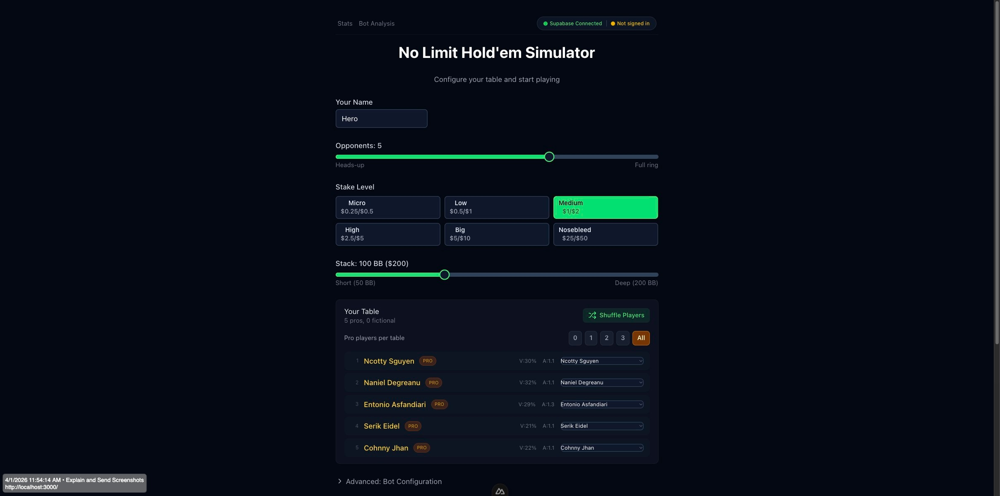
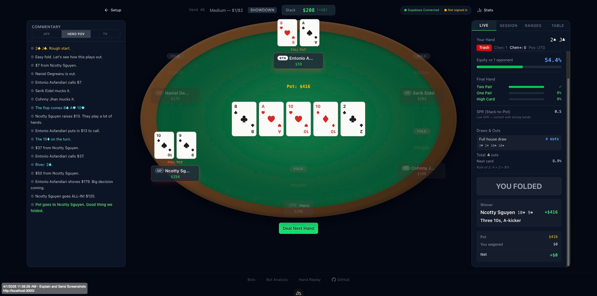
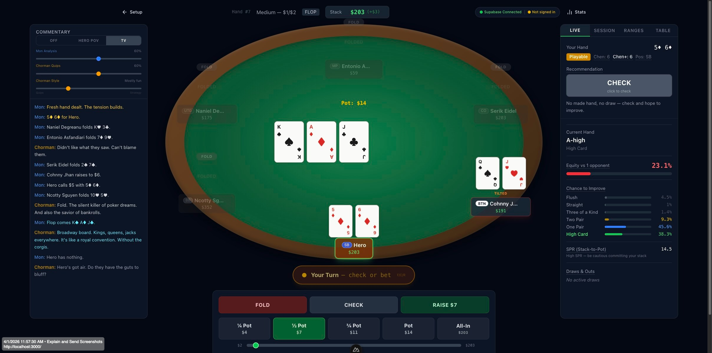
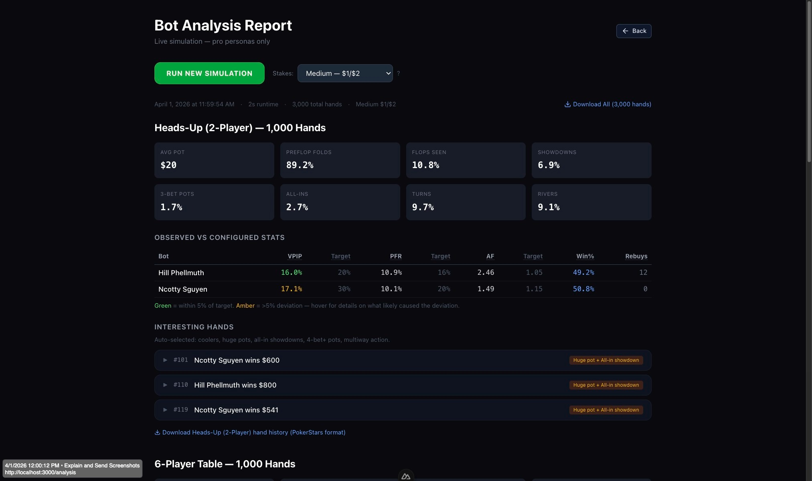

# No Limit Hold'em Simulator

**[Live Demo](https://nlh-simulation.netlify.app/)**

> **This is a free, open-source, single-player educational tool** -- no real money, no gambling, no multiplayer. The simulator itself is serious: three professional poker audits plus a full statistical realism overhaul (40+ fixes), real-time equity calculations, opponent HUD stats, and 27 bots with distinct playing styles. It just happens to also have funny commentary. Think of it as a poker training tool that doesn't take itself too seriously.


| | |
|---|---|
|  |  |
| *Setup: choose opponents, stakes, stack depth, and commentary mode* | *Showdown: Hero POV commentary, winner comparison, session stats* |
|  |  |
| *TV Broadcast: Mon & Chorman call the action, all cards face-up* | *Bot Analysis: 3,000-hand simulation with observed vs target stats* |

A browser-based No-Limit Texas Hold'em poker simulator with 27 intelligent bot opponents (including 20 pro-inspired personas), real-time hand analysis, live text commentary, and comprehensive cross-session stats. Built for learning poker strategy through practice, observation, and hand replay. Three rounds of professional poker audits (29 fixes) plus a statistical realism overhaul: combo-weighted ranges, board-relative hand strength, episodic tilt, raise-size-aware defense, per-persona range shapes and sizing personalities — validated against live-poker HUD bands with repeatable fixed-lineup simulations. Runs in the browser or as a native desktop app (macOS, Windows, Linux) via Tauri 2.

### Bot AI (21 realism fixes + 8 engine/rules fixes + statistical overhaul)
- **Card-aware decisions** -- bots evaluate actual hole cards and board texture, not random probabilities
- **Chen+ scoring** -- position- and style-adjusted hand strength (classic Chen also shown for reference)
- **Board texture analysis** -- dry/wet, ace-high, paired, monotone — affects c-bet rates, barrel frequency, bluff sizing
- **Kicker-aware hand strength** -- top pair ace kicker plays aggressively (0.48); top pair deuce kicker plays cautiously (0.38)
- **SPR awareness** -- shallow stacks commit faster (auto-shove at SPR < 2 with strong hands), deep stacks play positionally
- **Check-raises** -- bots trap with strong hands and raise when bet into, frequency varies by board texture
- **Position-aware 3-betting** -- 3.5x OOP, 3.0x IP, with aggression scaling
- **Street-aware barreling** -- turn card analysis (high cards = barrel, flush-completing = slow down), river scare card awareness
- **Preflop escalation** -- full 3-bet/4-bet/5-bet logic with per-persona frequencies
- **Short-stack push/fold** -- position-aware shove ranges (25-35% from BTN, 18-28% from EP)
- **Blocker-adjusted draws** -- flush draws discounted 5%, OESD 10%, gutshot 18%
- **Hero adaptation** -- bots adjust to your play style over a rolling 10-hand window
- **Table Flow** -- bots adjust when a player is dominating or running cold (20-hand rolling window)
- **River polarization** -- bots only bet monsters (value) and air (bluffs) on the river. Medium hands check. Core GTO concept.
- **Pre-computed opening ranges** -- uses the ranked 169-hand EV list with position shifts, not just Chen+ approximation
- **Range-shape personalities** -- per-persona `styleBias` (Negreanu plays suited connectors wider, Hellmuth favors big cards), `limpFreq` (Hellmuth's limpy "white magic", loose-passive stations), `betSizeMult` (small-ball vs big-bet), and `overbetFreq` (Dwan's 1.2-1.5x pot river bombs)
- **Board-relative hand strength** -- "two pair" using a board pair, board trips, and played-the-board rivers are scored as the marginal hands they are, not monsters
- **Minimum Defense Frequency (MDF)** -- bots defend enough of their range to prevent exploitable over-folding; multiway, the defense duty splits across remaining players (MDF is a heads-up concept)
- **Hero bet-sizing exploitation** -- bots detect if you bet big with value and small with bluffs (or vice versa), then adjust
- **Min-raise enforcement** -- engine enforces legal minimum raise amounts (last raise increment, not just BB). Short all-ins below min-raise are allowed but clamped correctly.
- **Half-raise rule** -- an incomplete all-in (less than a full raise) does not reopen action for players who already acted. Standard tournament/cash game rule.
- **Explicit draw detection** -- hand classification uses actual flush/straight draw detection, not strength-range overlap. Bottom pair is correctly identified as a made hand, not a draw.
- **Per-persona tilt** -- Phellmuth tilts after 1 loss; Pvey needs 10+ consecutive losses
- **Consistency system** -- bots occasionally misplay (1-12% depending on persona)
- **27 bot personas** (7 fictional + 20 pro) with VPIP/PFR/aggression/bluff/tilt/consistency profiles plus range-shape, limp, and sizing personalities

### Real-Time Analysis
- **Expected Value (EV)** -- live +EV/-EV display when facing a bet, with pot odds integration
- **Monte Carlo equity engine** -- 1,000 iterations against opponent ranges (doubled from 500 for higher accuracy)
- **Pot odds** -- side-by-side percentage comparison (Your Equity vs Need), with pass/fail verdict
- **Real-time outs and draws** -- flush, OESD, gutshot, overcards, full house, trips draws with exact hit probability
- **Authentic 6-max ranges** -- 169 hands ranked by EV, position-aware from UTG (15%) to BTN (42%)
- **Opponent HUD** -- live VPIP, PFR, Aggression Factor, WTSD with strategic reads
- **Action recommendation** -- FOLD/CHECK/CALL/RAISE pinned at top of stats panel, always visible

### Live Text Commentary
- **3-way mode selector** -- Off / Hero POV (default) / TV Broadcast. Defaults to Hero POV every session. Switch freely during play. TV mode confirms before flipping cards face-up mid-hand.
- **TV pause button** -- freeze the action in TV Broadcast mode to study bet sizing, board texture, and hand strength. Resume when ready. Only in TV mode.
- **Hero POV** -- first-person analysis commentary, straight play-by-play from your perspective
- **TV Broadcast** -- Chorman Nad & Mon LeEachern style dual-voice (homage to Norman Chad & Lon McEachern). All bot cards shown face-up, like watching WSOP on TV. Confirmation alert before enabling.
- **500+ unique Chorman Nad quips** -- ex-wife jokes, self-deprecating humor, poker puns, persona-specific references (Gaplan/Sweathogs, Phellmuth/tantrums, Twan/durrrr). Chorman names players in action quips: "Degreanu there. Another one bites the dust."
- **60+ bot/AI awareness quips** -- Chorman knows he's commentating a simulation against bots running JavaScript
- **120+ Mon LeEachern analytical phrases** -- board texture, player reads, pot dynamics, tilt detection, street transitions, showdown analysis
- **Inter-voice banter** -- Chorman reacts to Mon's analysis ("What Mon said. I understood about half of it."), Mon reacts to Chorman's jokes ("...Anyway. Back to the poker.") — just like the real WSOP broadcasts
- **Position-aware commentary** -- Mon includes table position on interesting plays: "Degreanu folds Ah Qd from the cutoff facing a raise. Disciplined." Chorman reacts to questionable position plays: "From under the gun with THAT?" Street-aware — no outs/draws mentioned after the river.
- **Three independent voice sliders** -- Mon Analysis (depth), Chorman Style (quips↔strategy), Chorman Frequency (every play → rare). Frequency slider gates ALL Chorman speech — turn it down to let Mon lead.
- **Chorman strategic mode** -- slide "Chorman Style" toward strategy and he drops real poker analysis: outs math, bet-sizing reads, board danger alerts, equity calls. At 50%+, Chorman prefers Mon-banter and strategic observations over quips. Slide toward quips for pure comedy. Default 30% serious.
- Text only, no audio

### Career Mode
- **Persistent bankroll** -- start with $150 at Micro; every session's result banks into your career
- **Six-tier ladder** -- lineups toughen as you climb: fictional fish at Micro, leaky pros mid-stakes, the elite (Pvey, Ceese, Twan) at Nosebleed
- **Real bankroll rules** -- move up with 10 buy-ins of the next stake (and 100 hands at your tier), forced down under 2 buy-ins, career over if you can't cover a Micro buy-in
- **Run history** -- busted and retired careers archive to a hall of fame (peak bankroll, peak tier, hands)
- All pacing numbers in `holdem.config.ts` → `career`

### Nemesis Bots
- **Bots keep a book on you** -- one persistent, decay-weighted model of your leaks (500-hand half-life; old reads fade as you improve)
- **Familiarity matters** -- each persona exploits you only as hard as its own history with you: a stranger plays you straight, a 300-hand regular plays the full exploit
- **Scouting report** -- every bot's profile modal shows what they know ("Folds to 3-bets 68% → 3-betting you wider") and their familiarity tier, up to Nemesis
- **Always learning, opt-in exploitation** -- career sessions always face the book; quick-play has a "Bots Remember You" toggle (default off). One-click reset.

### Tools & Export
- **Full hand evaluator** -- all 9 ranks, wheel/steel wheel detection, kicker tie-breaking
- **Fisher-Yates shuffle** with chi-squared verified uniformity across 10,000 deals
- **PokerStars hand history export** -- compatible with PokerTracker, Hold'em Manager, Equilab
- **Hand replay** -- two modes per hand: "Watch" (non-interactive step-through, all cards up, pause/study) and "Practice" (interactive, make different decisions, compare outcomes)
- **Hand detail modal** -- click any hand for PokerStars history, copy to clipboard, replay, analyze
- **Interactive bot analysis** (`/analysis`) -- run a 3,000-hand browser-side simulation (heads-up + 6-player + 8-player, pro personas only) with metrics, bot stats, auto-selected interesting hands with insights (leaks, good plays, teaching moments), and downloadable PokerStars hand histories per table size
- **Hand history replay viewer** (`/replay-hand`) -- paste any PokerStars hand history and watch it play out on the visual table. All cards face-up. Play/pause, speed control (0.5x-3x), step forward/back, keyboard shortcuts, action log. Click "Replay on Table" from analysis interesting hands.
- **Local persistence** -- session stats saved in your browser (localStorage); export hands as JSON/CSV/PokerStars anytime. No accounts, no cloud, no serverless.

## Table of Contents

- [Features](#features) -- poker table, hand analysis, ranges, HUD, betting, bot configurator, tilt, consistency, sessions, replay, stats, commentary
- [How the Bot Intelligence Works](#how-the-bot-intelligence-works) -- start here if you're wondering whether this is "AI"
  - [No AI, No Cloud, No Network](#no-ai-no-cloud-no-network) · [Where the Pro Stats Come From](#where-the-pro-stats-come-from) · [How a Stat Becomes a Decision](#how-a-stat-becomes-a-decision) · [Why Do It This Way?](#why-do-it-this-way)
- [How Bot Behavior Works](#how-bot-behavior-works) -- the full technical pipeline
  - [Poker Realism (audits)](#poker-realism-v0132--two-professional-audits) · [How This Compares to Pro Tools](#how-this-compares-to-pro-level-simulators) · [Persona Config Fields](#persona-config-fields)
  - [Chen Score](#chen-score--classic-preflop-hand-strength) · [Chen+](#chen--this-apps-position--and-style-adjusted-extension) · [Board Texture](#board-texture-analysis) · [Table Flow](#table-flow) · [Hero Adaptation](#hero-adaptation)
  - [Preflop Decision Flow](#preflop-decision-flow) · [Postflop Decision Flow](#postflop-decision-flow) · [Exploit Probe](#exploit-probe-adversarial-validation) · [Testing Approach](#testing-approach)
- [Tech Stack](#tech-stack)
- [Bot Simulation Script](#bot-simulation-script) -- headless bot-vs-bot simulation
  - [Analysis Report](#analysis-report) · [Usage](#usage) · [What It Tracks](#what-it-tracks) · [Interpreting Results](#interpreting-results) · [Multi-Run Analysis](#multi-run-analysis)
- [Getting Started](#getting-started)
- [Desktop App (Tauri)](#desktop-app-tauri) -- what it is, prerequisites, dev, release builds, CI
  - [Prerequisites](#prerequisites) · [Running in Development](#running-in-development) · [Building a Release Locally](#building-a-release-locally) · [CI Release Pipeline](#ci-release-pipeline)
- [Project Structure](#project-structure)
- [Configuration](#configuration)
- [Test Suites](#test-suites) -- 836 tests across 27 files
- [Poker Glossary](#poker-glossary)
- [Security](#security) -- red/blue audit log (web + desktop)
  - [Architecture & Threat Model](#architecture--threat-model) · [Audit Log](#audit-log) · [Security Headers](#security-headers) · [Desktop Hardening](#desktop-hardening-tauri) · [Accepted Risks](#accepted-risks)
- [Roadmap](#roadmap)
- [Future Enhancements](#future-enhancements)
- [Influences](#influences) -- Poker Academy Pro, PokerStars, Full Tilt, 2+2, Sklansky, ESPN WSOP
- [What Makes This Different](#what-makes-this-different)
- [License](#license)

## Features

### Poker Table
- 2-8 player tables with proper seat layout and position badges (UTG, MP, CO, BTN, SB, BB)
- Casino-dark aesthetic: emerald felt, walnut rail, gold accents
- Cards with CSS 3D flip animations
- Click any opponent's cards to peek at their hand (learning tool)
- Light/dark mode (table felt stays emerald green in both)

### Real-Time Hand Analysis
- **Hand strength**: Chen score + Chen+ (position/style-adjusted), preflop tier (Premium/Strong/Playable/Marginal/Trash), contextual hand descriptions ("Top Pair, Ace-kicker", "Nut Flush Draw")
- **Equity**: Monte Carlo simulation (1,000 iterations, ±1.5% standard error at 50% equity) against random opponent ranges. Preflop equity uses lookup table calibrated against pokerstove/equilab (AA 6-way: 49%, not the old linear 74%)
- **Hand improvement probabilities**: Per-rank % chance of making each hand by the river (e.g., "Flush: 19.2%", "Two Pair: 32.4%")
- **Draws and outs**: Flush draws, straight draws (OESD/gutshot), overcards, set draws with hit probability by next card and by river
- **Pot odds**: Side-by-side percentage comparison (Your Equity vs Need), with ratio shown as secondary reference, pass/fail verdict
- **Expected Value (EV)**: `(equity x pot) - call cost` -- green for +EV (profitable call), red for -EV
- **SPR**: Stack-to-Pot Ratio with strategic guidance (low/medium/high SPR advice)
- **Rule of 2/4**: Quick mental math approximation alongside exact calculations — multiply outs by 4 on the flop (two cards to come) or by 2 on the turn (one card). A flush draw with 9 outs is ~36% on the flop, ~18% on the turn. Slightly overestimates with many outs.
- **Action recommendation**: FOLD / CHECK / CALL / RAISE with position-aware reasoning per street. Color-coded: green (confident), yellow (marginal), red (fold). Pinned at top of stats panel so it's always visible without scrolling.

### Hand Ranges
- Authentic 6-max cash game opening ranges by position (UTG 15% through BTN 42%)
- All 169 starting hands ranked by expected value
- Expandable lists categorized by pairs, suited, and offsuit hands
- In-range indicator showing whether your current hand falls within each range
- Facing-aggression ranges: 3-bet (8%), call-vs-3-bet (12%), 4-bet (3.5%), 5-bet (1.5%)

### Opponent Stats (HUD)
- Per-player stats: VPIP, PFR, Aggression Factor, Went-to-Showdown %
- Player type labels: Nit, Tight, Solid, Loose, Very Loose
- Aggression labels: Passive, Balanced, Aggressive, Hyper-aggressive
- Strategic reads: "Nit -- 3-bet liberally, steal their blinds", "Calling station -- don't bluff, value bet thin"

### Betting Controls
- Fold / Check / Call buttons with live amounts and tooltips
- Raise presets: 1/4 pot, 1/2 pot, 3/4 pot, pot, all-in (click to raise instantly)
- Presets below min-raise are dimmed and disabled with tooltip explanation
- Continuous slider from min-raise to all-in (steps by BB) with min-raise indicator
- Custom exact-amount input with keyboard enter support
- All amounts clamped: never below min-raise, never above your stack
- Prominent bankroll display with running P&L and +/- from starting stack
- **Pre-action queuing**: "Pre-fold" and "Pre-check/call" buttons while bots are acting. Cancel anytime before your turn.

### Bot Configurator

The setup screen shows your full table roster with inline controls. Each bot can use a named persona, a quick-select preset, or fully custom stats.

**7 Fictional Personas** -- each with a distinct playstyle and exploitable leak:

| Persona | VPIP | PFR | Aggression | Consistency | Leak |
|---------|------|-----|------------|-------------|------|
| Tight Tony | 14% | 11% | 0.85 | 95% | Folds too much to 3-bets, won't bluff rivers |
| Loose Lucy | 38% | 22% | 1.10 | 92% | Plays too many hands, especially suited junk |
| Aggressive Alex | 26% | 22% | 1.40 | 93% | Over-bets draws, 3-bets too wide |
| Calling Carl | 30% | 12% | 0.60 | 90% | Calls too much postflop, rarely raises |
| Tricky Tina | 24% | 18% | 1.15 | 94% | Slow-plays big hands, check-raises too often |
| Solid Sam | 22% | 17% | 1.00 | 97% | Nearly GTO -- the toughest fictional bot |
| Wild Wendy | 34% | 28% | 1.50 | 88% | Massive over-aggression, 25% bluff frequency |

**18 Pro Player Bots** -- modeled after real-world poker legends with per-persona tilt and consistency:

| Pro | VPIP | Style | Tilt | Consistency |
|-----|------|-------|------|-------------|
| Hill Phellmuth | 20% | Near-GTO, massive tilt after losses | 2.5x | 96% |
| Naniel Degreanu | 32% | Suited connectors from any position, creative | 0.5x | 96% |
| Ihil Pvey | 23% | Near-perfect, rare mistakes, almost untiltable | 0.3x | 99% |
| Boyle Drunson | 28% | Power poker, traps with monsters | 0.4x | 96% |
| Tennifer Jilly | 30% | Unpredictable tight/loose mix | 0.7x | 91% |
| Lhil Paak | 27% | Unorthodox, analytical, float bets | 0.6x | 93% |
| Entonio Asfandiari | 29% | Charismatic aggressor, constant pressure | 0.9x | 94% |
| Kabe Gaplan | 26% | Steady, intelligent, solid fundamentals | 0.8x | 95% |
| Bean-Robert Jellande | 36% | Fearless gambler, huge bluffs | 1.4x | 90% |
| Mike the Mouth | 28% | Solid until tilt -- then reckless all-ins | 2.2x | 91% |
| Mhris Coneymaker | 30% | Online grinder, occasional overplays | 1.1x | 92% |
| Rhip Ceese | 24% | Legendary, near-zero leaks, ice cold | 0.3x | 98% |
| Utu Sngar | 26% | Genius reads, fearless, erratic brilliance | 1.0x | 93% |
| Sanessa Velbst | 25% | Fearless aggressor, relentless 3-bets | 0.8x | 95% |
| Serik Eidel | 21% | Quiet assassin, tight, patient, untiltable | 0.3x | 98% |
| Dom Twan | 31% | "durrrr" hyper-LAG, massive bluffs | 0.5x | 95% |
| Aatrik Pantonius | 24% | Finnish ice, calm, precise | 0.4x | 97% |
| Ncotty Sguyen | 30% | Loose-aggressive with flair, tilts on bad beats | 1.2x | 91% |
| Cohnny Jhan | 22% | Old-school TAG, traps, patient, consistent | 0.5x | 97% |
| Krynn Benney | 25% | Modern GTO high-roller, creative lines | 0.6x | 95% |

**How pro stats are derived:** The 20 pro persona stats are hand-crafted archetypes, not pulled from a PokerTracker or HendonMob database. Each profile is built from publicly known playstyle characteristics -- interviews, televised hands, training content, and community consensus about how these players approach the game. VPIP/PFR values reflect the player's documented tight-or-loose tendencies (e.g., a known LAG gets 30%+ VPIP, a known nit gets sub-22%). Aggression, bluff frequency, and tilt multipliers are tuned to match the player's public reputation (e.g., a famously tilt-prone player gets a high tilt multiplier; a "poker robot" gets near-zero). Consistency values reflect perceived technical precision. The goal is _recognizable playstyle archetypes_ for learning, not exact replication of real-world database stats. All pro persona names use swapped initials to avoid identity appropriation.

**Table composition:**
- **Pro count selector**: 0 / 1 / 2 / 3 / All pros per table (default 2)
- **Shuffle Players** button to randomize the mix (click repeatedly)
- **Inline swap dropdown** on each seat to pick any persona
- **PRO badge** on pro bots, VPIP and aggression stats at a glance
- No duplicate personas at a table

**6 Quick-Select Presets** for instant archetype assignment:

| Preset | VPIP | PFR | Aggression | Style |
|--------|------|-----|------------|-------|
| Nit | 12% | 9% | 0.70 | Ultra-tight, folds everything marginal |
| Tight | 18% | 14% | 0.90 | Solid, conservative, few leaks |
| TAG | 22% | 18% | 1.20 | The winning style -- selective but aggressive |
| LAG | 30% | 24% | 1.40 | Wide range, lots of pressure |
| Loose-Passive | 35% | 14% | 0.50 | Calls everything, rarely raises |
| Maniac | 40% | 32% | 1.60 | Plays almost every hand, maximum aggression |

**Custom Sliders** -- tweak any individual stat per bot:

| Stat | Range | What it controls |
|------|-------|------------------|
| VPIP | 10-50% | How many hands the bot plays (tight vs loose) |
| PFR | 5-40% | How often it raises preflop (passive vs aggressive) |
| Aggression | 0.3-2.0 | Multiplier on postflop bets and raises |
| Bluff Frequency | 3-30% | How often it bets with nothing |
| Creative Frequency | 1-15% | Limp-reraises, donk bets, check-raise bluffs |

**Dynamic features:**
- **Auto-naming**: Bot names update when stats drift from the preset ("Loose Lucy" becomes "Aggro Lucy" if you crank aggression)
- **Plain-English summary**: Real-time description of what all sliders mean together

### Tilt System
- Per-persona tilt multiplier scales how fast they tilt and how hard it hits
- **Phellmuth (2.5x)**: Tilts after 1 loss, massive stat swings
- **Pvey (0.3x)**: Needs 10+ consecutive losses, barely changes even when tilted
- **Mild tilt**: VPIP +4%, aggression +0.15, bluff freq +3%
- **Full tilt**: VPIP +8%, PFR +4%, aggression +0.3, bluff freq +6%
- Tilt decays over 3-6 hands, then returns to baseline
- Visual indicator: "TILTED" (orange) or "FULL TILT" (red, pulsing) badge on nameplate

### Consistency System
- Each bot has a consistency rating (0.88-0.99)
- Before each decision, rolls against consistency. On fail, makes a random off-strategy play.
- **Near-perfect (0.98-0.99)**: Ihil Pvey, Rhip Ceese, Serik Eidel -- misplay ~1-2% of decisions
- **Very disciplined (0.95-0.97)**: Solid Sam, Boyle Drunson, Aatrik Pantonius, Cohnny Jhan
- **Mostly solid (0.92-0.94)**: Degreanu, Utu Sngar, Coneymaker, Lhil Paak
- **Inconsistent (0.88-0.91)**: Wild Wendy, Jellande, Mike the Mouth, Ncotty Sguyen

### Session Management
- **5-minute hero timeout**: Inactivity auto-folds current hand, pauses game, saves session. Resume or end from pause screen.
- **Bust-out**: Showdown results display first, then "Buy More Chips" (re-buy) or "Cash Out" options
- **Re-buy**: Starts a new session at original starting stack. Tracked independently in lifetime stats.
- **Auto-save**: Session saved to localStorage on every hand and on tab close
- **Speed after fold**: Bot actions run ~5x faster when hero has folded
- **Stats navigation preserves game state**: Click Stats mid-hand, view analytics, come back to exact same game state

### Action Status Indicators
- **Bot thinking**: Centered pill between table and bet controls with bouncing dots
- **Your Turn**: Amber pill with call amount or "check or bet" hint
- **Pre-action queue**: Shows queued action with cancel button

### Stat Tooltips
- Hover any dotted-underlined label for an explanation
- Covers: Equity, Chen Score, Chen+, Position, Pot Odds, EV, SPR, Draws & Outs, Recommendation

### Persistence

The app is fully local — no accounts, no cloud, no serverless functions:

- Session stats are saved to `localStorage` — they survive page refresh but not a browser-data clear
- Export everything anytime: JSON, CSV, or PokerStars hand history format
- The stats page (`/stats`) reads the same localStorage data
- Future idea: browser-side SQLite (e.g. sql.js/OPFS) for richer cross-session hand-history queries — still with zero server code

### Hand Replay (`/replay`)
- Click **"Replay"** on any hand in the stats page to re-live it
- Same hole cards, same board, same players and positions
- Hero gets full bet controls at each decision point to try different lines
- Bots re-run their AI (probabilistic -- may vary slightly each replay)
- **Comparison panel** at showdown: Original result vs Replay result with profit difference
- **"Replay Again"** button to try the same hand multiple times

### Live Text Commentary

**Note: this is text commentary, not audio.** Lines appear in a scrolling panel to the left of the table -- there is no voice synthesis, no audio, and no sound. Think of it as reading a live transcript of a poker broadcast, not listening to one.

If you've ever watched the World Series of Poker on ESPN, you know the magic of Lon McEachern and Norman Chad calling the action. Lon delivers the smooth play-by-play -- who raised, who folded, what hit the board. Norman provides the color commentary -- the jokes, the self-deprecating humor, the ex-wife references, the absurd analogies. Together they turned poker broadcasts into appointment television. This feature is a text-based love letter to that experience -- you read the banter as the hand plays out, line by line, in real time.

The commentary panel sits to the left of the table and provides a constant stream of real-time text reactions to every action in every hand. Two modes run simultaneously in the background, so switching between them is instant -- you never miss a line.

#### Hero POV (default)

The Hero POV mode reads like the internal monologue of a player sitting at the table. It only knows what you know: your hole cards, the community board, bet sizes, and opponent actions. It never reveals opponent cards or hidden information.

- First-person voice: *"We pick up A♠ K♦. Strong hand."*, *"We fold. On to the next one."*
- Reacts to every action at the table: blind posts, folds, calls, raises, checks, all-ins
- Evaluates your hand against the board: *"We flopped Two Pair!"*, *"Missed the flop completely."*, *"Big draw -- 9 outs."*
- Notes opponent tendencies from their persona profile: *"Tight player raising -- respect it."*
- Opponent cards stay face-down on the table (normal play mode)
- Useful for immersion -- it feels like having a poker coach whispering in your ear

#### TV Broadcast (Chorman Nad & Mon LeEachern)

Switch to TV Broadcast mode and the entire experience transforms. All bot hole cards flip face-up on the table, just like watching the WSOP on television where the camera shows every player's cards while you watch from the couch. Hero still has full agency -- you make all your own decisions -- but now you're playing inside a televised poker broadcast, complete with the commentary team.

**Mon LeEachern** (blue label) calls the action straight: who bet what, who has which hand, what hit the board. Professional, clear, informative. The steady voice that grounds the broadcast.

**Chorman Nad** (amber label) is the color commentary. The goofy puns. The self-deprecating humor. The ex-wife jokes. The absurd analogies. The running commentary that has nothing to do with poker and everything to do with making you laugh while someone shoves all-in with seven-deuce.

Sample lines:
- *"Pure bluff! Betting on hope and a prayer. Mostly hope."*
- *"ALL-IN with THAT?! I've made better decisions at 3 AM at a Waffle House."*
- *"That hand should come with an apology note."*
- *"Smooth call with the best hand. That's how I play... and also how I lose."*
- *"I've seen the future, and someone's going to like it."*
- *"That's poker. The cruelest game ever invented by someone who hated happiness."*
- *"Winner winner, chicken dinner. I never understood that expression. Why chicken? Why not steak?"*

**Persona-specific commentary:** Chorman has custom quips for each of the 20 pro-inspired bots, referencing their real-world counterparts' reputations and quirks:

| Bot | Chorman's Take |
|-----|---------------|
| Hill Phellmuth | Tilt, tantrums, the Poker Brat -- *"If this doesn't go his way, expect fireworks. And by fireworks I mean a tantrum."* |
| Kabe Gaplan | Welcome Back, Kotter -- Sweathogs, Barbarino, Horseshack -- *"Up your nose with a rubber hose -- that's what he's saying to their chip stacks."* |
| Dom Twan | The "durrrr" challenge, online legend lore -- *"He bets like he's allergic to folding."* |
| Boyle Drunson | Super/System, the Godfather of Poker -- *"He wrote the book on it. Literally."* |
| Ihil Pvey | Machine-like precision -- *"I've never seen him blink. Literally never."* |
| Bean-Robert Jellande | Fearless gambler -- *"He'd bluff his own grandmother. And probably has."* |
| Mike the Mouth | Solid until tilt -- *"If he loses this one, clear the blast radius."* |
| Rhip Ceese | Legend, near-zero leaks -- *"Playing against him is like playing against a wall. A very expensive wall."* |
| Utu Sngar | Genius reads -- *"Fearless and brilliant. A terrifying combination at a poker table."* |
| Serik Eidel | The Quiet Assassin -- *"You won't hear him coming. You'll just hear your chips leaving."* |
| Entonio Asfandiari | The Magician -- *"He makes your chips disappear. Get it? Magician?"* |
| Kabe Gaplan | *"Horseshack would be raising here too. 'Ooh ooh ooh, Mr. Kotter!'"* |

...and custom lines for Tennifer Jilly, Sanessa Velbst, Aatrik Pantonius, Ncotty Sguyen, Mhris Coneymaker, Cohnny Jhan, Krynn Benney, Naniel Degreanu, and Lhil Paak.

**Why this exists:** I built this because I genuinely enjoy Norman and Lon's commentary. The WSOP broadcasts are as much about the commentary booth as they are about the cards. Norman Chad's humor -- the terrible puns, the running gags, the complete inability to take anything seriously while analyzing serious poker -- is a huge part of what makes watching poker fun. This feature tries to capture a fraction of that energy. It's not meant to replace the real thing (nothing could), but if you've ever smiled at "My ex-wife..." or groaned at one of Norman's puns, this mode is for you.

**Voice controls (TV Broadcast mode):**

In TV Broadcast mode, two sliders appear below the mode selector to fine-tune the commentary experience:

| Slider | What it controls | Default | Range |
|--------|------------------|---------|-------|
| **Mon Analysis** | Depth of Mon's card/hand/draw analysis. At 0%, Mon only announces bare actions ("${name} raises to $20"). At 100%, every line includes hand strength, draw callouts, board texture. | 60% | 0--100% |
| **Chorman Quips** | How often Chorman chimes in on routine actions (folds, calls, checks, standard raises). Chorman always speaks on big moments regardless of this setting. | 60% (silence=40) | 5--100% |

Chorman **always** reacts to: bluffs, all-in shoves with junk, big laydowns (folding premium hands or made hands), slow-plays, showdown results, coolers/bad beats, and foreshadowing. The slider only affects routine actions where his commentary is entertaining but optional.

The sliders let you dial in your preferred experience: crank Chorman to max for comedy, dial him down for focus, turn Mon's analysis up to learn, or strip it to bare action calls for a clean broadcast feel.

**Hand-specific commentary:** Chorman's lines aren't just random -- they react to what's actually happening:
- **Pocket pairs**: Specific quips for aces ("The hand that launched a thousand bad beat stories"), kings ("The first best hand at losing to an ace on the flop"), queens, jacks
- **Board texture**: Monotone flops ("If you don't have a flush draw, it's time to panic"), paired boards, all-broadway, all-low, ace-high
- **River drama**: "The final card. Where dreams come true and nightmares are born. Often simultaneously."
- **Big pots**: "I've had apartments smaller than that pot."
- **Heads-up**: "One on one. Mano a mano. Bot a... boto?"
- **Draw chasing**: "Outs are like friends -- the more you have, the better. I have neither."

**Self-aware moments:** Chorman occasionally acknowledges he's commentating a simulation (~8% chance per hand):
- *"These bot names... they seem familiar. I can't quite place the faces though. Probably for legal reasons."*
- *"Playing poker against bots. In a simulation. On a computer. This is the future my guidance counselor warned me about."*
- *"I wonder if the bots know they're bots. Existential poker questions, brought to you by Chorman Nad."*

**Slider reactions:** When you adjust Chorman's quip slider mid-game, he reacts in real time:
- Turned up: *"Oh, you want MORE of me? That's the nicest thing anyone's done since my second wife said 'I do.'"*
- Turned down: *"Oh, I'm being turned down. This feels very familiar. Like every date I've ever been on."*

**Setup screen:** Commentary can be toggled on/off from the setup screen before dealing (default: on). When off, the commentary column is completely hidden and no lines are generated. This is purely optional -- it doesn't affect the simulation in any way.

**Technical details:**
- Both streams generate simultaneously on every game event -- switching modes displays the other stream's full history instantly
- 400+ unique Chorman quips across 20+ categorized no-repeat pools (action, result, atmosphere, hand-specific, persona, self-aware, slider reactions)
- `UniquePool` class tracks used indices per pool -- never repeats within a game, resets each new hand
- 20 pro bots each have 4-5 persona-specific quips (~40% chance to fire on any pro action)
- Foreshadowing peeks at pre-dealt turn/river cards (~35-40% of applicable situations)
- Auto-scrolls to new lines; pauses auto-scroll if user scrolls up manually
- Toggle (on/off), mode (Hero/TV), Mon analysis level, and Chorman quip frequency all persisted in localStorage
- Three-column desktop layout at `xl` breakpoint (1280px+): Commentary | Table | Stats

### Stats Page (`/stats`)
- **Overview**: Lifetime hands, profit, avg pot, hands/session, winning/losing session counts, best/worst session, win rate, showdown rate, won-at-showdown %, fold rate, profit trend sparkline, performance by position, recent hands (last 20, reverse chronological -- click to expand details with Replay/Analyze/Export)
- **Sessions**: History cards with per-session stats, individual delete, per-session JSON/CSV/PokerStars export
- **Hands**: Click any row to open a detail modal -- PokerStars-format hand history with color-coded streets, all players' hole cards, copy-to-clipboard, and per-hand export
- **Hand Analysis Modal**: Click "Analyze" on any hand for a detailed street-by-street instructional breakdown:
  - Player profiles with playstyle, stats, tilt, and leak descriptions
  - Per-action explanations referencing Chen/Chen+, board texture, hand strength, draws, and the specific bot's persona
  - Showdown summary and personalized key takeaway
- **Export**: Lifetime and per-session in JSON, CSV, and PokerStars .txt (compatible with PokerTracker, Hold'em Manager, Equilab)
- **Delete**: Per-session or all lifetime data with confirmation dialogs
- **Winner shown at showdown** for every outcome (win, loss, fold) with cards and amount

### Authentic Deal Sequence
- Fisher-Yates shuffled 52-card deck (statistically uniform, no duplicates)
- Burn cards before flop, turn, and river
- Preflop -> Flop (3) -> Turn (1) -> River (1) -> Showdown
- Hero sees hole cards face-up; opponents face-down until showdown (or click-to-peek)
- Early wins (everyone folds) don't show undealt streets

## How the Bot Intelligence Works

> **Short version: there is no AI here.** No large language model, no neural network, no machine-learning model, no cloud service, and no API call of any kind. Every bot decision is made by a few hundred lines of ordinary TypeScript running locally in your browser (or the desktop WebView), in well under a millisecond. The running app makes **zero network requests** to decide anything — it works completely offline. The "intelligence" is hand-written poker logic plus a random-number generator, and that's the whole story.

This section explains, in plain terms, **where the pro numbers come from**, **how the app turns those numbers into decisions**, and **why it's all deterministic local math** rather than an AI. For the exhaustive, layer-by-layer pipeline (Chen+, board texture, SPR, MDF, hero adaptation, street-by-street barreling), see [How Bot Behavior Works](#how-bot-behavior-works) directly below.

### No AI, No Cloud, No Network

The entire decision engine is the function `decideBotAction()` in `app/utils/botDecision.ts`. When it is a bot's turn, the game hands that function the bot's two cards, the board, the pot, the bet it is facing, its position, and a little history — and the function returns one of `fold` / `check` / `call` / `raise` (plus a size). That's it. To be unambiguous about what is *not* involved:

- **No language model, no neural network.** Nothing is "prompted." There is no model file, no inference step, no training data. Contrast this with PokerSnowie (a neural net trained on billions of hands) or a GTO solver like PioSOLVER (which iterates to a Nash equilibrium) — see the [comparison table](#how-this-compares-to-pro-level-simulators). This app is firmly in the *hand-crafted heuristic* camp.
- **No server, no API, no telemetry.** A bot never sends your hand anywhere and never fetches a move. As of v0.18 the app is local-only, and as of v0.19 even the icons are bundled into the build — so the running app makes no outbound calls at all. Disconnect from the internet and nothing changes.
- **The only randomness is `Math.random()`.** And it is *not* used to pick moves blindly. It is used to hit *target frequencies* — so a bot configured to bluff 14% of the time actually bluffs about 14% of the time, and two identical spots don't always play out identically. Remove the random rolls and the logic is fully deterministic: same cards + same context → same reasoning, every time.
- **It's fast and private because it's just math.** Each decision is a handful of comparisons and multiplications. No latency, no account, no data ever leaves your device.

### Where the Pro Stats Come From

Every poker player has a statistical fingerprint — the same numbers a tracking HUD (PokerTracker, Hold'em Manager) shows on screen: **VPIP** (how often they voluntarily enter a pot), **PFR** (how often they raise preflop), **AF** (aggression factor), **3-bet%**, **WTSD** (went to showdown), and so on. Each of the 27 personas *is* exactly that — a row of those numbers in `holdem.config.ts`. The full list of fields and what each one controls is in [Persona Config Fields](#persona-config-fields); here we care about how the numbers were chosen.

They are **authored, not scraped and not learned.** Each persona's numbers are informed estimates that combine (a) the player's real-world reputation and era with (b) the published statistical *bands* for that archetype in live full-ring poker. A few examples of the intent:

- **Hill Phellmuth** (Phil Hellmuth) — tight and limpy with a big-card bias and a famously short fuse: `VPIP 18 / PFR 11`, high `limpFreq`, `tiltMultiplier 2.5`.
- **Dom Twan** (Tom Dwan) — hyper-aggressive LAG with oversized bets: `VPIP 32 / PFR 26`, `betSizeMult 1.2`, `overbetFreq 0.18`.
- **Ihil Pvey** (Phil Ivey) — relentless and nearly unreadable: high aggression, `consistency 0.99`, `tiltMultiplier 0.3`.

(The names are deliberately scrambled — this is parody and homage, not a claim to reproduce any real person's actual hand histories.)

Crucially, the numbers are then **validated by simulation, not by a live feed.** The headless simulator (`scripts/simulate.ts`) and the in-engine helpers `simulateBotStats()` / `simulateEscalationStats()` deal thousands of hands and report each bot's *observed* VPIP / PFR / AF / per-opportunity 3-bet% right next to its *configured* targets. The configs were tuned until observed ≈ configured **and** the table-wide stats (preflop fold-outs, flops seen, showdowns, 3-bet pots, all-in %) landed inside real-NLH ranges. After the v0.18 statistical overhaul, observed VPIP lands within ~1–2 points of config across repeated runs. In other words, the "realism" is a closed loop you can re-run yourself: change a number, simulate, watch the behavior move. (See [Bot Simulation Script](#bot-simulation-script).)

Two supporting sets of numbers come from the same place:

- **Fictional teaching bots** (Tight Tony, Loose Lucy, …) are deliberately exaggerated archetypes with on-purpose leaks, so you can learn to exploit a "type" before facing a subtler pro.
- **Archetype presets** (Nit / Tight / TAG / LAG / Loose-Passive / Maniac) are textbook templates you can drop onto any seat in the bot configurator.

### How a Stat Becomes a Decision

The idea that ties it all together: a percentage stat is turned into an action by combining a **measurement of the bot's actual hand** with either a **threshold** or a **dice roll** derived from that stat. Two patterns do almost all of the work.

**Pattern 1 — stat as a threshold (preflop hand selection).** The bot converts its two cards into one of the 169 starting-hand classes and looks them up in a fixed, EV-ranked list to get a **percentile**: AA ≈ top 0.5%, QJo ≈ top 16%, 72o = the very bottom. Because the list is *combo-weighted*, "`percentile < VPIP`" literally means "this hand is in the best VPIP% of all hands I could be dealt." So:

- A bot with **VPIP 25%** plays the **top ~25% of hands — not a random 25%.**
- **Position** nudges the percentile (a Button hand counts as ~8% stronger; UTG ~3% weaker), because the same cards are worth more when you act last.
- **Style Bias** nudges it per category, so two bots with the *same* VPIP still play *different* hands (Negreanu's suited connectors, Hellmuth's big cards).

**Pattern 2 — stat as a dice roll (frequencies: bluffs, 3-bets, barrels).** For actions that should happen *some percentage of the time*, the engine computes a target rate from the persona's stat (and the situation), then rolls `Math.random()` against it. A 3-bet, for instance, is split into **value 3-bets** (gated by raw card quality vs a threshold from `threeBetFreq`) and **bluff 3-bets** (gated by `Math.random() <` a rate from `threeBetFreq`). Postflop bet/raise rates start from `aggression` and `bluffFreq`, then get multiplied by board texture, position, and SPR before the roll. Over thousands of hands these rolls realize the configured frequencies — which is exactly what the simulator checks.

**A worked example.** It is folded to two different bots in middle position, each dealt **Q♣ J♦ (QJo)**, which ranks around the **top 16%** of starting hands:

- **Tight Tony** (VPIP 14%): 16% is *outside* his top-14% opening range → **fold.**
- **Loose Lucy** (VPIP 38%): 16% is well *inside* her range → **open-raise** (size ≈ a 2.2–2.5× base × her `betSizeMult`, nudged by aggression).

Same two cards, opposite decisions — and the only thing that changed was one number in a config file. Now say Lucy gets called and the flop comes dry and King-high. As the preflop raiser she has a **range advantage**, so her c-bet rate is high (~0.85 for a strong hand on a dry board) × position and SPR modifiers; `Math.random()` clears it and she fires ~half-pot. Hold the same spot but give her air on a soaked, draw-heavy board and that rate collapses toward her `bluffFreq` — she mostly checks.

**Postflop, in one breath.** After the flop the bot scores its *actual* hand on a 0–1 strength scale — made-hand rank, kicker quality, board-relative discounts (a "two pair" that's really one pair plus a pair on the board is marked down), and draw equity with blocker discounts — then buckets it: **monster ≥ 0.55, strong ≥ 0.35, weak-made 0.10–0.35, draw, or nothing < 0.10.** From there the same two patterns apply, filtered through board texture, position (in/out), SPR, who raised preflop, how many players are in, and a few opponent reads. Defensive guardrails keep it honest: **MDF** (defend enough not to be exploited by big bets), **call-down discipline** (fold marginal hands to sustained turn/river pressure), **bet-size sensitivity** (fold top pair to overbets), and **river polarization** (only monsters and busted draws bet; medium hands check). The full street-by-street version is in [How Bot Behavior Works](#how-bot-behavior-works).

### Why Do It This Way?

Because the goal is a game that is **fun, instant, and runs anywhere** — not a training solver. Heuristics give recognizable, distinct *personalities* (a solver plays one "perfect" style; these bots each play like *someone*), decisions in microseconds with no install or account, and behavior you can read, tune in the configurator, and re-simulate yourself. The honest trade-off — less bet-sizing granularity and no per-opponent range solving versus a paid tool — is laid out in [How This Compares to Pro-Level Simulators](#how-this-compares-to-pro-level-simulators).

## How Bot Behavior Works

Every decision a bot makes passes through a layered pipeline in `app/utils/botDecision.ts`. The bot doesn't pick randomly -- it evaluates its actual hole cards against the board, adjusts for position and playstyle, considers who's been winning, remembers what the hero tends to do, and then decides based on the combination of all those factors. Each layer is described below.

### Poker Realism (v0.13.2 — two professional audits)

The bot decision engine was reviewed from a professional poker perspective across two audit rounds. Sixteen realism fixes were applied, bringing the engine to ~73-76% realism vs commercial poker training software.

**Round 1 — core mechanics (9 fixes):**
- **3-bet sizing**: Position-aware — 3.5x OOP, 3.0x IP (was flat 3.0x)
- **Check-raises**: Bots check strong/monster hands with intent to raise when bet into
- **C-bet frequency**: Scaled by board texture (85% dry, 55% wet) and opponent count (HU/3-way/4+)
- **Kicker differentiation**: Top pair ace kicker (0.48) plays very differently from top pair deuce kicker (0.38)
- **Short-stack push/fold**: Position-aware — BTN/CO shove top 25-35%, EP stays tight at 18-28%
- **Blocker-adjusted draws**: Draw equity discounted per draw type (flush 5%, OESD 10%, gutshot 18%)
- **Overcard equity**: Two overcards (AK on low board) score 0.22-0.25, suited get a bonus
- **Turn/river barreling**: Turn card analysis (high cards = barrel, flush-completing = slow down). River considers scare cards.
- **Donk bets**: Fictional bots lead into the raiser; pro bots use texture-based leading

**Round 3 — solver-adjacent (5 improvements):**
- **River polarization**: Bots only bet monsters (value) and air (bluffs) on the river. Medium hands check. Fundamental GTO concept.
- **Pre-computed opening ranges**: Uses the ranked 169-hand EV list with position shifts instead of Chen+ approximation.
- **Minimum Defense Frequency (MDF)**: Bots compute MDF when facing a bet and defend enough of their range to prevent exploitable over-folding.
- **Hero bet-sizing exploitation**: Bots detect if hero bets big with value and small with bluffs (or vice versa) after 8+ showdown hands, then adjust calling frequency accordingly.
- **Commentator name swap**: Mon LeEachern & Chorman Nad (same initial-swap pattern as the pro player bots)

**Round 2 — advanced dynamics (7 fixes):**
- **SPR awareness**: Shallow SPR (<4) = commit with strong hands, auto-shove monsters. Deep SPR (>12) = cautious, positional play. Affects c-bet, commitment, and raise decisions.
- **Paired board c-betting**: Trips+ bet 1.2x more on paired boards (protect). Overcards/air check 50% more (opponent has trips when continuing).
- **Check-raise texture**: Dry boards 1.4x boost (safe to trap), wet 0.6x (too many draws), paired 1.3x (trap with sets).
- **River fold equity**: Passive opponents' river bets treated as real (0.3x bluff multiplier). Probe bluffs on river vs passive reduced to 0.5x.
- **Strong-hand threshold**: Lowered from 0.40 to 0.35 — all top pairs are "strong" regardless of kicker.
- **Multiway inverse discount**: Monsters discount 20% less in multiway (still profitable). Bluffs discount 15% more (no fold equity).

**Round 4 — statistical audit (6 fixes):** _(historical — several mechanisms below were further reworked by the v0.18 statistical realism overhaul; see CHANGELOG 0.18.x for current behavior)_

A gambling-statistics review across 14,000+ simulated hands (3K×6-max mixed, 3K×6-max pros, 5K×8-max pros, 3K×6-max fictional) identified five systematic deviations from expected NLH distributions. All were fixed and re-validated:

- **Raise-or-fold preflop opens**: Bots now open-raise with their full VPIP range instead of only PFR. Limping is eliminated — matches modern NLH strategy where open-limping is a significant leak.
- **Reduced cold-calling**: Facing a single raise, cold-call ranges narrowed significantly. OOP cold-calls dropped from 75% to 60% of VPIP; IP from 85% to 85% (unchanged). The freed-up hands go to 3-bets, matching the modern 3-bet-or-fold tendency.
- **Increased 3-bet frequency**: Base 3-bet calculation raised from `pfr × 0.35 × aggression` to `pfr × 0.45 × aggression`. Per-bot 3-bet% now ranges from 3-7% (was 0% due to tracking bug — see below).
- **SB 3-bet-or-fold strategy**: Small blind now raises 70% of its defense range (was ~PFR%). Worst postflop position should rarely flat-call. BB raises 45% of defense (has pot-odds discount for flatting).
- **Tilt VPIP cap**: Tilt can only widen a bot's VPIP by 50% of base value (e.g., 20% → max 30%), preventing tilt-prone bots like Hill Phellmuth from becoming unrecognizable. Previously, Phellmuth's tilt inflated his observed VPIP from 20% to 30%+.
- **Per-bot 3-bet% tracking**: Fixed a reporting bug where `threeBetCount` was initialized but never incremented. Now correctly identifies the 2nd+ preflop raise as a 3-bet and attributes it to the player. Also fixed postflop AF to count bets (not just raises) per the standard formula.

**Before/after (3K-hand 6-max averages):**

| Metric | Before | After | Real NLH |
|--------|--------|-------|----------|
| Preflop fold-outs | 28-32% | 44-47% | 40-55% |
| Flops seen | 62-72% | 53-55% | 45-60% |
| Showdowns | 46-53% | 40% | 35-45% |
| 3-bet pots | 22-25% | 26% | 20-30% |
| All-in hands | 20-28% | 18-19% | 10-20% |
| Phellmuth VPIP (cfg 20%) | 30-31% | 24-26% | ≤25% |
| Per-bot 3-bet% | 0.0% (bug) | 3-7% | 3-10% |

**Round 5 — position-aware postflop aggression (7 improvements):**

The postflop decision engine previously made position-blind decisions — a bot on the button played the same as a bot under the gun after the flop. This is a major strategic error: acting last (in position) is the single biggest postflop advantage in poker.

- **IP aggression multiplier (1.25x)**: All postflop betting/raising rates increased 25% when in position. C-bets, turn barrels, river bets, and bluffs all fire more often IP.
- **OOP caution multiplier (0.85x)**: Betting rates reduced 15% when out of position. OOP play is inherently disadvantaged — correct strategy is to check more and let IP player act.
- **IP probe bets**: When checked to in position, bots now bet aggressively with the full range (85% with monsters, 55% with strong hands, 40% with draws, 25% with weak made, bluff-freq with air). Board texture modifies all rates.
- **OOP donk bet reduction**: Pro bots lead into the raiser less often from OOP (15% + aggression × 0.15, down from 25% + aggression × 0.25). Donk-betting OOP is a well-known leak.
- **IP strong-hand raises (22% × aggression)**: Bots raise strong hands ~twice as often in position (was 12% × aggression flat). Extracts more value with the information advantage.
- **IP semi-bluff raises (75% boost)**: Draw semi-bluff raise rate increased from `bluff × aggression × 0.40` to `× 0.75` in position. IP semi-bluffs have both fold equity and draw equity.
- **IP floating**: Bots call with nothing on the flop more often in position (35% of VPIP vs half-pot bets IP, 15% OOP) to steal on later streets.

**Verified** across 36,000+ simulated hands (10 simulation runs with 6 and 8 player tables, pro and fictional bots). All 810 unit tests pass. Aggression Factor ranges from 1.5 (passive) to 3.2 (hyper-aggressive), matching real player archetypes. All aggregate stats (preflop fold-outs, flops seen, showdowns, 3-bet pots, all-in hands) fall within expected NLH distributions.

### How This Compares to Pro-Level Simulators

This simulator was designed to be **fun and fast** first, realistic second. It runs in a browser with zero latency — every bot decision takes microseconds, not the seconds-to-minutes that solver-based tools require. Here's an honest comparison:

| Dimension | This App | PokerSnowie (~$85/yr) | PioSOLVER (~$250) |
|-----------|----------|----------------------|-------------------|
| **Preflop ranges** | 169-hand ranked list with position shifts | Neural-net trained on billions of hands | Exact Nash equilibrium per spot |
| **Postflop decisions** | Heuristic: hand strength buckets + texture + SPR | Neural-net: continuous equity estimation | Exact: iterates to equilibrium (30s-5min per spot) |
| **River play** | Polarized (monsters + bluffs bet, medium checks) | GTO-balanced value/bluff ratios | Perfectly balanced by definition |
| **MDF defense** | Implemented (prevents over-folding) | Built into neural net | Exact calculation |
| **Opponent adaptation** | Hero sizing tells + table-wide reads | Exploit mode adjusts to specific leaks | N/A (solvers compute vs. ranges, not opponents) |
| **Speed** | Instant (< 1ms per decision) | ~100ms per decision | 30 seconds to 5 minutes per decision |
| **Fun factor** | High (commentary, personas, tilt, live HUD) | Medium (training focused) | Low (analysis tool, no gameplay) |
| **Runs in browser** | Yes | No (desktop app) | No (desktop, heavy CPU/RAM) |
| **Price** | Free | ~$85/year | ~$250 one-time |

**Where this app is stronger:**
- Personality and entertainment (27 distinct bot personas with tilt, commentary, card-peek)
- Instant gameplay with no setup (browser, no install, no configuration)
- Real-time hand analysis panel with EV, equity, draws, pot odds, action recommendations
- Hand replay, PokerStars export, session stats, all built in
- WSOP-style text commentary with 400+ unique quips

**Where pro tools are stronger:**
- Bet sizing variety (pro tools use 33%/50%/75%/100%/150% pot situationally; this app uses ~50-65% mostly)
- Per-opponent range narrowing (this app uses table-wide reads; Snowie tracks individual opponents precisely)
- GTO balance (solvers guarantee unexploitable play; this app uses frequency-based heuristics)

**The honest verdict:** This app is ~80% as realistic as PokerSnowie and ~65% as realistic as a GTO solver. The gap is primarily in bet sizing granularity and per-opponent range tracking. For learning poker fundamentals, practicing against distinct personalities, and having fun, it's excellent. For training to beat $5/$10+ online games, use a solver.

**Remaining gaps** (would require solver-level integration or neural-net training to fix):
- No per-opponent range narrowing based on their preflop/flop/turn actions
- No explicit GTO balance checking (frequency-based heuristics instead)
- Bet sizing uses ~3-4 discrete sizes (35%/50%/65% pot) rather than the continuous sizing solvers compute

**Important context for serious players:**
- **Cash game only** -- no tournament mode, no ICM (Independent Chip Model), no bubble dynamics. All strategy is optimized for deep-stack cash game play.
- **No rake** -- real cash games take 2.5-10% of each pot as rake (capped). This means marginal +EV calls shown in the simulator would be -EV in a raked game. Keep this in mind when studying borderline decisions.
- **No time bank** -- bots decide instantly. Real-time pressure and decision fatigue are not simulated.

### Persona Config Fields

Each of the 27 bot personas is defined by a set of numerical stats in `holdem.config.ts`. These stats control every aspect of how the bot plays:

| Field | Range | What it controls | Example impact |
|-------|-------|------------------|----------------|
| **VPIP** | 0.14--0.38 | Fraction of hands the bot voluntarily enters. This is the primary "loose vs tight" knob. | Tight Tony (14%) sees ~1 in 7 hands. Loose Lucy (38%) sees ~1 in 3. |
| **PFR** | 0.11--0.28 | Fraction of hands the bot raises preflop. Always <= VPIP. The gap between VPIP and PFR determines how often the bot flat-calls vs raises. | Calling Carl: VPIP 30%, PFR 12% -- he calls a lot but rarely raises. Dom Twan: VPIP 31%, PFR 26% -- almost every hand he plays, he raises. |
| **Aggression** | 0.60--1.50 | Multiplier on postflop betting and raising frequency. Directly scales c-bet rates, barrel frequencies, and raise sizing. | Carl at 0.60 checks and calls. Dom Twan at 1.50 bets and raises at every opportunity. |
| **Bluff Frequency** | 0.08--0.25 | How often the bot bets or raises with nothing (air). Controls c-bet bluffs, barrel bluffs, and river bluffs. | Tight Tony (8%) almost never bluffs -- if he bets, he has it. Wild Wendy (25%) bets with air a quarter of the time. |
| **Creative Frequency** | 0.03--0.12 | Probability of unconventional plays: limp-reraises, trap-checks with monsters, slow-plays. | Lhil Paak (11%) and Utu Sngar (12%) take the most unorthodox lines. Tight Tony (3%) is textbook. |
| **3-Bet Frequency** | 0.028--0.22 | Per-opportunity rate of re-raising an open: value 3-bets (premium hands) plus bluff 3-bets (fold equity). Pros run live-realistic 3--9%; fictional teaching bots stay hot. Squeeze spots and full-ring tables discount it automatically. | Hill Phellmuth (2.8%) almost never 3-bets — his real-life leak. Wild Wendy (22%) 3-bets constantly. |
| **4-Bet Frequency** | 0.014--0.10 | How often the bot re-raises a 3-bet. Much narrower range than 3-bets. | Wild Wendy (10%) 4-bets liberally. Most pros are 1.5--4%. |
| **5-Bet Frequency** | 0.005--0.02 | How often the bot puts in the 5th bet preflop (essentially committing their stack). Almost always AA/KK. | Dom Twan at 2% does this with a slightly wider range than most. |
| **Donk Bet Frequency** | 0.00--0.22 | How often the bot leads (bets) into the preflop raiser on the flop, rather than checking to them. This is considered a weak play by professionals. **All pro bots have 0%.** | Calling Carl (22%) donk-bets constantly -- a classic recreational player habit. Loose Lucy (18%) and Wild Wendy (20%) also lead frequently. Pro bots never donk-bet; they check to the raiser and use check-raises or floats instead. |
| **Tilt Multiplier** | 0.3--2.5 | How fast the bot tilts after losing pots it actually played (folding preflop neither tilts nor calms) and how severely tilt affects their play. | Hill Phellmuth (2.5x) tilts after a single lost pot and becomes a maniac for a few hands. Ihil Pvey (0.3x) needs 10+ consecutive lost pots and barely changes. |
| **Consistency** | 0.88--0.99 | The probability of making the "correct" decision each hand. On a consistency miss, the bot makes a random off-strategy play (fold when it should call, raise with nothing, etc.). | Ihil Pvey (99%) almost never misplays. Wild Wendy (88%) makes a random play ~12% of the time. |
| **Limp Frequency** | 0--0.65 | Chance to open-limp (instead of fold) hands in the PFR--VPIP gap when first in. Pros default to raise-or-fold (0). | Hill Phellmuth (55%) limps his "white magic" range. Calling Carl (65%) limps everything playable. |
| **Style Bias** | per-category | Range *shape*: percentile shifts per hand category (suited connectors, big cards, pairs, suited aces) — so two bots with the same VPIP play different hands. | Naniel Degreanu plays suited connectors wider; Hill Phellmuth favors big cards; Boyle Drunson loves pairs; Sanessa Velbst 3-bets suited aces. |
| **Bet Size Multiplier** | 0.85--1.20 | Sizing personality applied to opens and all postflop bets. | Naniel Degreanu (0.85x) plays small-ball. Dom Twan (1.2x) bets big everywhere. |
| **Overbet Frequency** | 0--0.18 | Chance to overbet (1.2--1.5x pot) river value hands and bluffs — the polarized big-bet line. | Dom Twan (18%) drops river bombs. Most personas ~3%. |
| **Leak** | text | A natural-language description of the bot's primary weakness, shown in the hand analysis modal and bot gallery. | "Folds too much to 3-bets; won't bluff rivers" (Tight Tony) |

### Chen Score — Classic Preflop Hand Strength

The [Chen formula](https://en.wikipedia.org/wiki/Texas_hold_%27em_starting_hands#Chen_formula) is a well-known system for ranking preflop starting hands on a 0--20 scale. It was created by Bill Chen and published in _The Mathematics of Poker_. The scoring rules:

| Component | Rule | Examples |
|-----------|------|---------|
| **Highest card** | A=10, K=8, Q=7, J=6, others=rank/2 | K-high hand starts at 8 |
| **Pair bonus** | Score = max(highest_card × 2, 5) | 22=5, 77=7, AA=20 |
| **Suited bonus** | +2 | AKs scores 2 more than AKo |
| **Gap penalty** | 1-gap: -1, 2-gap: -2, 3-gap: -4, 4+gap: -5 | T8s (-1 gap), T7s (-2 gap) |
| **Straight potential** | +1 if connected/1-gap and both cards < Q | 87s gets +1, KQs does not |
| **Final** | Round up, minimum 0 | |

**Where Chen works well:**
- Quick mental math at the table -- you can compute it in your head in seconds
- Correctly identifies the strongest hands (AA=20, KK=16, QQ=14)
- Properly rewards suitedness and connectedness
- Good for absolute hand ranking when you need a single number

**Where Chen breaks down:**
- **No position awareness.** Chen gives ATo the same score whether you're UTG (first to act, 5 players behind) or on the Button (last to act, maximum information). In practice, ATo is a clear fold UTG but a standard open on the Button.
- **No playstyle context.** A tight-aggressive player extracts different value from AQo than a loose-passive player does. Chen doesn't account for how a player's style affects which hands are profitable.
- **Overvalues some hands, undervalues others.** Small suited connectors like 76s score low (6) but are among the most profitable hands from late position for loose players. Meanwhile, hands like K9o score decently but are trap hands that dominate poorly.
- **No multiway awareness.** Suited hands go up in value at full tables (flush potential against more opponents) while big offsuit hands go down, but Chen treats both the same regardless of table size.
- **Preflop only.** Chen scoring stops after the deal. It says nothing about postflop playability, implied odds, or how well a hand navigates multiple streets.

### Chen+ — This App's Position- and Style-Adjusted Extension

Chen+ starts with the classic Chen score and applies context-aware adjustments based on where you're sitting and how you play. This is the score bots actually use for preflop decisions.

**Position adjustments:**

| Position | Adjustment | Why |
|----------|------------|-----|
| **Button / Dealer** | +2 | You act last on every postflop street. This information advantage makes marginal hands profitable -- you see what everyone does before deciding. The Button is the most profitable seat in poker. |
| **Cutoff** | +1 | Second-best position. Nearly as good as the Button, with only one player behind. |
| **Big Blind** | +1 | You've already invested 1 BB. Getting a discount to see the flop means weaker hands become worth defending. |
| **MP / MP+1** | 0 | Middle position -- no adjustment. Standard play. |
| **UTG / UTG+1** | -1 | Worst positions. You act first with 4--5 players behind who could wake up with a monster. Need a stronger hand to enter. |
| **Small Blind** | 0 | Discount is offset by worst postflop position (first to act every street). |

**Playstyle adjustments** (applied when bot/hero profile is available):

| Condition | Adjustment | Why |
|-----------|------------|-----|
| **Suited connectors + loose player** (VPIP > 27%) | +1 | Loose players see more flops, so they realize the implied odds of speculative hands more often. 76s is worth more to someone who plays 30% of hands than to a nit playing 15%. |
| **Suited gapper + creative player** (creative freq > 8%) | +1 | Creative players profit from unusual holdings because opponents can't put them on a hand. When you limp-reraise with T8s, nobody sees it coming. |
| **Big cards + tight-aggressive** (VPIP < 22%, aggression > 1.2) | +1 | TAGs get more value from big-card hands because they play them aggressively and get action from worse hands. When a tight player bets, loose opponents still call with dominated hands. |

**How Chen+ drives bot decisions:**

The Chen+ score is mapped to a **percentile** -- the fraction of all 1,326 unique starting hands that are this strong or better. This mapping was calibrated empirically by scoring all 1,326 hands (not estimated from a formula). The percentile thresholds:

| Chen+ Score | Percentile | Hands at this level |
|-------------|-----------|---------------------|
| 20+ | 0.5% | AA |
| 16+ | 0.9% | KK |
| 14+ | 1.4% | QQ, AKs |
| 12+ | 2.1% | JJ, AQs, AKo |
| 10+ | 4.4% | TT, AJs+, KQs |
| 8+ | 10.7% | 99, broadways |
| 7+ | 17.8% | 88, suited connectors |
| 6+ | 25.5% | 77, suited one-gappers |
| 5+ | 37.0% | 66, most suited hands |
| 4+ | 53.2% | Low suited, mid offsuit |
| 3+ | 70.0% | Weak suited, offsuit broadways |
| 2+ | 85.0% | Junk suited |
| 0--1 | 100% | Pure trash |

A bot with VPIP 0.30 plays any hand whose Chen+ percentile falls below 0.30. Because Chen+ is position-adjusted, the same ATo might qualify from the Button (Chen+ 10 → 4.4%) but not from UTG (Chen+ 8 → 10.7%). This is exactly how real players think: "I'd open this from the Button but fold it under the gun."

**Concrete example -- A♠ T♦ at a 6-max table:**

| Seat | Chen | Chen+ | Percentile | Action |
|------|------|-------|------------|--------|
| UTG | 8 | 7 (-1) | 17.8% | Fold for a 15% VPIP player |
| MP | 8 | 8 (±0) | 10.7% | Borderline -- plays for 11%+ VPIP |
| CO | 8 | 9 (+1) | ~7% | Opens for most players |
| BTN | 8 | 10 (+2) | 4.4% | Clear open for everyone |

Both the classic Chen score and the Chen+ score are shown in the stats panel during play so you can see the difference position makes.

### Board Texture Analysis

After the flop, every decision considers the **board texture** -- the pattern of community cards and what kinds of hands they favor. The engine categorizes boards along several dimensions:

| Property | Detection | Impact on bot play |
|----------|-----------|-------------------|
| **Ace-high** | Highest card is an ace | Preflop raiser c-bets more (they have more aces in range). River bluffs are more credible -- "I have the ace." |
| **Broadway-heavy** | 2+ cards >= Jack | Favors the raiser's range (big cards). Less donk-betting from callers. |
| **Low board** | All cards <= 9 | Favors the caller's range (small pairs, suited connectors). Raiser c-bets less. |
| **Dry** | No flush draw, low connectedness, unpaired | Fewer draws mean fewer scare cards on later streets. Bots bluff more (opponents fold more on dry boards). Smaller bet sizing. |
| **Wet** | Flush draw + connected cards | Many draws possible. Bots bet bigger to charge draws. Less bluffing (opponents call more with draws). |
| **Monotone** | 3+ cards of one suit | Flush is possible. Bots slow down significantly unless they have the flush. |
| **Two-tone** | 2 cards of one suit | Flush draw possible. Bots size up to charge the draw. |
| **Paired** | Board has a pair | Full house and trips are possible. Bots bluff less (opponents may have trips). |
| **Connected** | Cards are close in rank | Straight draws are likely. Bots bet to deny free cards. |

**Range advantage** is computed per street: the preflop raiser's range (weighted toward big cards and premium pairs) has an advantage on ace-high and broadway boards. The preflop caller's range (weighted toward suited connectors, small pairs) has an advantage on low, connected boards. This multiplier adjusts c-bet frequency, barrel rate, and bluff sizing.

### Table Flow

Real players adjust when someone is on a hot streak or when the table dynamic shifts. The table flow system tracks a 20-hand rolling window of winners and adjusts bot profiles before each decision:

| Situation | Detection | Bot adjustment | Real-world analogy |
|-----------|-----------|---------------|-------------------|
| **Someone is dominating** | Any player's win rate > 28% in the window | Reduce bluff frequency by up to 40%. Increase aggression by up to 30% when they do play. | "That guy is crushing -- don't bluff him, but when I have a hand, I'm going to trap him." |
| **Bot is running cold** | This bot's win rate < 10% over 15+ hands | Widen VPIP by up to 8%, PFR by up to 5%. | "I haven't won a hand in forever. I need to get involved or I'll get blinded out." |
| **Bot is running hot** | This bot's win rate > 25% | Tighten VPIP slightly (up to 5%), reduce bluffs by up to 12%. | "I'm up big. No need to gamble -- protect the stack and play strong hands." |

The adjustments are bounded and gentle -- a bot's fundamental personality doesn't change, but it adapts around the edges, just like a real player would.

### Hero Adaptation

After tracking 10+ hands of the hero's play (via `useHeroProfileStore`), bots begin exploiting observed tendencies:

| Hero tendency | Detection | Bot exploit |
|--------------|-----------|-------------|
| **Folds to 3-bets a lot** | Fold-to-3-bet > 60% | Bot 3-bets wider (up to 1.6x their normal rate). Free money. |
| **Very loose** | VPIP > 40% | Bot reduces bluffs (hero calls too often for bluffs to work). Value bets thinner. |
| **Passive** | Low aggression factor | Bot bluffs more (hero won't raise back, so bluffs are safer). |

### Preflop Decision Flow

When it's a bot's turn preflop, the decision proceeds in this order:

1. **Consistency check**: Roll against the bot's consistency (0.88--0.99). If the roll fails, return a random weighted action -- fold (40%), call (40%), or raise (20%) when facing a bet; check (60%) or random bet (40%) otherwise. This simulates human error.

2. **Hero adaptation**: If 10+ hands tracked, adjust the bot's profile based on hero tendencies.

3. **Table Flow**: Adjust profile based on table dynamics (hot/cold/dominated).

4. **Short-stack check**: If below 25 BB and facing a raise, switch to push/fold mode. Shove with top ~15-25% of hands (wider when desperate), fold everything else.

5. **Hand percentile**: Look up the hole cards in the ranked 169-hand EV list and convert to a **combo-weighted percentile** (pairs = 6 combos, suited = 4, offsuit = 12 of 1,326 — so "percentile < VPIP" plays exactly VPIP% of dealt hands). Apply the position shift (BTN -8pp ... UTG +3pp), the persona's `styleBias` category shift, and a small jitter.

6. **Decision**:
   - **First in (or over limpers)**: Open-raise the top `PFR x 1.6` of hands (capped at VPIP) — the open range runs wider than headline PFR because 3-bet opportunities are rarer. Hands in the remaining PFR-VPIP band open-limp at the persona's `limpFreq` (Phellmuth 55%, stations 45-65%, most pros 0) and otherwise fold. Open size is position-based (2.2x late / 2.5x early, scaled by aggression and `betSizeMult`).
   - **Blind defense**: BB defends 125% of VPIP (pot discount), raising 45% of its defense range. SB plays 3-bet-or-fold-heavy (raises 70% of defense).
   - **Facing an open**: Value 3-bet by raw card quality (55% of `threeBetFreq`), bluff 3-bet by persona randomness (45%), cold-call from the VPIP-PFR gap (stations flat wide, raise-or-fold TAGs flat narrow; very loose players wider still), or fold. All thresholds shrink continuously with raise size, with callers already in (squeeze discount), and at full-ring tables.
   - **Facing a jam** (>=15bb or >=60% of stack): equity-driven, premium-only continues that narrow with jam size — a 20bb shove gets called by ~TT+/AQs+, a 100bb open-jam by ~KK+. Facing a reraise-jam in a pot you opened, defense widens so jam-spam can't run the table over.
   - **Facing a 3-bet**: Value 4-bet by raw card quality, bluff 4-bet, flat call (45% of VPIP), or fold.
   - **Facing a 4-bet**: Shove `fiveBetFreq` (~AA/KK), call (20% of VPIP), or fold.
   - **Facing a 5-bet+**: Only continue with the top 1% of hands.

### Postflop Decision Flow

After the flop, decisions are **position-aware** and **board-texture-aware**. All betting and raising rates are multiplied by a position factor: **1.25x in position (IP)** and **0.85x out of position (OOP)**. Acting last is the biggest postflop advantage in poker — IP players bet more, bluff more, and extract more value because they have information about their opponent's action before deciding.

**When not facing a bet:**

1. **C-bet** (if preflop raiser on the flop): Rate scales with hand strength (80% with strong hands, 55% with draws, 20% with air) multiplied by board texture (higher on dry/ace-high boards, lower on wet/low boards) and position (IP c-bets more). Reduced 35% in multiway pots. Bet sizing: smaller on dry boards (~35% pot), larger on wet boards (~65% pot) to charge draws.

2. **Second barrel** (if bet the flop, now on the turn): Strong hands 75%, draws 45%, air bluffs scale with `bluffFreq * aggression * texture_modifier * position`. Board texture reduces barreling on monotone boards (flush now possible) and boosts it on dry boards.

3. **Third barrel** (if bet flop and turn, now on the river): Monsters 85%, air bluffs are board-aware and position-scaled: boosted 1.5x on ace-high dry boards, 1.3x on wet boards that bricked, reduced 0.7x on paired boards. Medium-strength hands always check (river polarization).

4. **IP probe bet** (not the preflop raiser, in position): When checked to in position, bots attack aggressively — 85% with monsters, 55% with strong hands, 40% with draws, 25% with weak made hands, and at bluff frequency with air. Board texture modifies all rates. This is one of the most profitable situations in poker.

5. **OOP donk bet** (not the preflop raiser, out of position): Pro bots rarely donk-bet (15% + aggression × 0.15, texture-dependent). Fictional bots lead at their `donkBetFreq` rate. Donk-betting OOP is considered a leak by professionals.

**When facing a bet:**

Hand strength is **board-relative**: "two pair" using a board pair, board trips, and played-the-board rivers are scored as the marginal hands they are, not monsters. MDF splits across multiway defenders.

- **Monster hands**: Raise for value (20% + aggression × 30%), boosted IP. Check-raise OOP on dry boards. Shallow-SPR (<2) commits on flop/turn only — one-pair hands never raise-jam rivers (nothing to protect).
- **Strong hands** (top-pair class): Call normal bets, but respect pressure — fold to oversized bets (>0.7x pot) at a rate rising with size and falling with strength, fold to sustained turn/river barrels (passives call down more), and give multiway flop bets extra respect.
- **Draws** (flop/turn only): Semi-bluff raise rate is **75% higher in position** (bluffFreq × aggression × 0.75 IP vs × 0.40 OOP). Call if pot odds justify. Fold otherwise.
- **Weak made hands**: Call small bets on the flop, tighten by street. River calls are rare.
- **Nothing**: Fold almost always. IP bluff-raises are twice as frequent as OOP. IP floats flop bets to steal later streets.

Street pressure increases from flop (1.0x) to turn (0.75x) to river (0.55x). Passive players call down more; aggressive players fold or raise instead of flat-calling. River value bets and bluffs can become 1.2-1.5x pot overbets at the persona's `overbetFreq`.

### Exploit Probe (adversarial validation)

`scripts/exploit-probe.ts` plays a scripted hero with one degenerate strategy per run against a fixed pro lineup and reports hero EV in bb/100. Stacks reset to exactly 100bb every hand so each hand is an i.i.d. sample at the depth the bots are calibrated for. If the bots are sound, every degenerate strategy loses:

```bash
yarn probe all 10000
```

| Probe strategy | What it tests | Result (10,000 hands) |
|---|---|---|
| open-jam (any two, 100bb) | jam-call discipline | **-306 bb/100** |
| 3bet-jam (any two over opens) | fold-to-3-bet exploitability | **-314 bb/100** |
| overbet-spam (1.5x pot every street) | fold discipline | **-1,274 bb/100** |
| minraise-spam | over-folding to min bets | **-858 bb/100** |
| station (call everything) | thin value betting | **-1,115 bb/100** |
| nit-value (jam only QQ+/AK) | paying off too light | **-14 bb/100** |

The suite runs in CI as a regression gate (`tests/exploit-probe.test.ts`): every strategy must stay below +10 bb/100. An earlier version of this table waved off nit-value at +64 bb/100 as "mildly +EV, as in real life" — the gate proved that wrong. Root cause was twofold: the reraise-jam defense floor ignored jam size (bots called 100bb 3-bet jams with top ~3.4% hands — TT/AQ — paying off premium-only jammers), and the old refill-when-felted harness let stacks balloon past 1,000bb, so a handful of monster coolers dominated the metric (±100 bb/100 run-to-run noise). The floor now decays with jam size (full defense vs ≤40bb jams, ~QQ+/AK vs 100bb, ~KK+ at several hundred bb) and the harness pins stacks at 100bb.

### Exploitable Leak Audit (historical — pre-v0.18 configs)

Every bot has tendencies a skilled player can exploit — that's the point. But are these leaks intentional (persona design) or accidental (engine bugs)? An earlier audit ran 60,000 hands across 12 pro-only simulation runs and aggregated per-bot stats and profit/loss across every appearance. _Stats below reflect pre-overhaul persona configs._

**Consolidated stats across all runs (bots appearing 2+ times):**

| Bot | Apps | VPIP (cfg) | Δ | PFR (cfg) | AF (cfg) | Win% | Avg P/L |
|-----|------|-----------|---|----------|---------|------|---------|
| Rhip Ceese | 5 | 21.4% (24%) | -2.6 | 14.4% (19%) | 2.05 (1.25) | 14.1% | **+$32,089** |
| Hill Phellmuth | 5 | 24.5% (20%) | +4.5 | 17.0% (16%) | 2.69 (1.05) | 14.4% | -$7,232 |
| Sanessa Velbst | 4 | 25.2% (25%) | +0.2 | 18.1% (21%) | 2.55 (1.40) | 16.0% | -$13,390 |
| Entonio Asfandiari | 3 | 28.4% (29%) | -0.6 | 18.5% (23%) | 2.36 (1.30) | 16.3% | -$23,431 |
| Ncotty Sguyen | 3 | 31.3% (30%) | +1.3 | 17.7% (20%) | 2.15 (1.15) | 15.8% | **+$22,661** |
| Utu Sngar | 3 | 27.7% (26%) | +1.7 | 18.5% (22%) | 2.51 (1.35) | 15.6% | -$16,384 |
| Serik Eidel | 2 | 19.8% (21%) | -1.2 | 13.6% (17%) | 1.95 (1.05) | 14.1% | **+$24,746** |
| Naniel Degreanu | 2 | 28.4% (32%) | -3.6 | 15.9% (20%) | 1.99 (1.10) | 16.1% | -$18,534 |
| Mike the Mouth | 2 | 32.4% (28%) | +4.4 | 20.4% (22%) | 2.79 (1.25) | 15.1% | -$21,589 |
| Ihil Pvey | 2 | 19.1% (23%) | -3.9 | 13.9% (19%) | 2.21 (1.15) | 11.9% | -$16,078 |
| Aatrik Pantonius | 2 | 21.5% (24%) | -2.5 | 16.4% (20%) | 2.28 (1.20) | 13.6% | -$11,390 |

**Profit/loss leaders (average across all appearances):**

| Rank | Bot | Avg P/L | Why |
|------|-----|---------|-----|
| 1 | **Rhip Ceese** | +$32,089 | Tight + disciplined + untiltable (0.3x). Patience wins in aggressive games. |
| 2 | **Serik Eidel** | +$24,746 | Tightest pro (19.8% VPIP), near-zero tilt. The quiet assassin. |
| 3 | **Ncotty Sguyen** | +$22,661 | Loose but aggressive (31.3% VPIP). Gets paid when he hits. |
| ... | | | |
| 9 | **Naniel Degreanu** | -$18,534 | Speculative hands bleed chips facing aggression. |
| 10 | **Mike the Mouth** | -$21,589 | Tilt (2.2x) destroys sessions. Solid player who self-destructs. |
| 11 | **Entonio Asfandiari** | -$23,431 | Constant pressure is expensive when opponents don't fold. |

**What a poker pro would exploit — the complete scouting report:**

| Bot | Exploitable Pattern | How to Exploit | Category |
|-----|-------------------|----------------|----------|
| **Hill Phellmuth** | VPIP balloons +5 above config from tilt (2.5x multiplier). Plays 30%+ hands for 3-6 hands after every loss. AF jumps to 2.7+ on tilt. | 3-bet him after he loses a pot — he's now playing too wide. Call his raises lighter than usual. When he's not tilted (20% VPIP), respect his bets. | Intentional tilt design |
| **Mike the Mouth** | Same tilt pattern as Phellmuth (2.2x). VPIP inflates from 28% to 33%+. Biggest average loser among pros despite solid fundamentals. | Wait for the blowup, then value bet relentlessly. His tilt sessions erase his winning sessions. | Intentional tilt design |
| **Bean-Robert Jellande** | Highest VPIP of all pros (35-38%). Plays too many hands and bluffs too aggressively (bluffFreq 0.22). Tilt-prone (1.4x). | Never bluff him — he calls too wide. Value bet thin (top pair, good kicker is enough). Let him hang himself with his own aggression. | Intentional persona leak |
| **Naniel Degreanu** | Plays 28% despite 32% config — the position system correctly folds his speculative hands from EP. PFR/VPIP ratio of 0.56 (too passive entering pots). Consistent loser (-$18K avg). | His "loose creative" reputation is overstated. He's actually tight-passive in aggressive games. 3-bet him — he cold-calls too much. | Position system working correctly |
| **Entonio Asfandiari** | Biggest average loser (-$23K). High aggression (AF 2.36) + constant pressure = expensive when opponents have position. | Let him bet into you. Call down with medium-strength hands — his bluff frequency (0.19) means he's betting air nearly 1 in 5 times. | Intentional persona (charismatic aggressor) |
| **Mhris Coneymaker** | PFR/VPIP ratio 0.53 — enters 31% of pots but only raises 17%. Classic cold-calling leak. | 3-bet him relentlessly from any position. He flat-calls too much preflop and doesn't fight back. Squeeze him when he cold-calls in multiway pots. | Intentional persona (amateur grinder) |
| **Ihil Pvey** | VPIP 19% vs 23% config — plays tighter than expected. Lowest win rate (11.9%) despite "near-perfect" billing. Near-zero tilt (0.3x) means no exploitable blow-ups, but also no adjustment. | Steal his blinds aggressively — he folds too much. His discipline is also his weakness: he doesn't adapt when being exploited. | Correct behavior (tight in aggressive game) but persona undersells results |
| **Rhip Ceese** | Biggest winner (+$32K avg). VPIP 21.4%, AF 2.05 after aggression bump. Only leak: VPIP slightly below config. | Ceese is the hardest bot to exploit. Tight entry, disciplined postflop, untiltable. The only edge: he's slightly too tight, so you can steal his blinds more than against a looser pro. Small edge, hard to realize. | Near-zero leaks (as designed) |
| **Sanessa Velbst** | VPIP dead-on (25.2% vs 25% cfg) but consistent loser (-$13K avg) despite high aggression. Her 3-bet-heavy style (6% 3-bet) runs into strong hands too often. | Call her 3-bets wider than usual — she's 3-betting light. When she barrels three streets, she's polarized: either the nuts or a bluff. Medium hands should fold; strong hands should call. | Intentional persona (fearless 3-bettor) |
| **Serik Eidel** | Second biggest winner (+$25K avg). Tightest pro observed (19.8% VPIP). Near-zero tilt. Quiet, patient, positionally aware. | Similar to Ceese — steal his blinds, but don't try to outplay him postflop. He only continues with strong hands, and he doesn't make mistakes. | Near-zero leaks (the quiet assassin) |

**Three categories of observed deviations:**

**1. Intentional persona leaks** — Phellmuth's tilt, Jellande's gambling, Mike's blowups, Coneymaker's cold-calling, Asfandiari's over-aggression. These are working as designed. Real poker players have exploitable tendencies, and modeling them is the entire point of the persona system. The profit/loss data confirms: tilt-prone players (Mike, Phellmuth) and hyper-aggressors (Asfandiari) are consistent losers, while disciplined players (Ceese, Eidel) are consistent winners. This is exactly how real poker works.

**2. Measurement artifacts** — PFR runs 3-5 points below config for almost every bot. This isn't an engine bug. In aggressive games, most VPIP entries come from *defending against raises* (calling or 3-betting), not from opening. Since calling counts as VPIP but not PFR, the PFR/VPIP ratio naturally compresses. The real-world equivalent: a player with a 24/19 HUD stat in a passive game might show 24/15 in an aggressive game. Same player, different dynamics. AF also runs 1.5-2x above the config `aggression` value because the config field is a *multiplier on base betting rates*, not a direct AF target — base c-bet/barrel rates are already high, and the multiplier scales them further.

**3. Persona tuning** — Rhip Ceese's aggression was bumped from 1.10 to 1.25 after the initial audit showed he was playing too passively for a "legend." Post-bump, his AF rose from 1.81 to 2.05 and he became the biggest winner across 5 appearances (+$32K average). The lesson: a legendary player isn't just tight — they're selectively aggressive when they do play. The bump captured this.

**Verdict:** No engine bugs were found. Profit/loss correlates correctly with persona design: disciplined, low-tilt players win; tilty, over-aggressive players lose. All deviations are either intentional design choices, expected measurement artifacts, or persona tuning (one config adjustment). The statistical engine is sound.

### Testing Approach

Four levels of verification, each more realistic than the last:

| Level | Hands/Bot | What it tests | Speed |
|-------|-----------|---------------|-------|
| **Simplified** (`phase4-bot-behavior`) | 100K | Pure probability engine, no cards | ~30ms |
| **Universal** (`phase4-all-personas`) | 500K | All 25 bots, stat alignment, ordering | ~230ms |
| **Realistic** (`phase4-realistic-sim`) | 50K | Real cards, hand evaluator, position variation, tilt lifecycle | ~16s |
| **Escalation** (`phase6-escalation`) | 50K | 3-bet/4-bet/5-bet rates, fold-to-3-bet, per-persona verification | ~6s |

## Tech Stack

| Layer | Choice |
|-------|--------|
| Framework | Nuxt 4 (`ssr: false` -- static SPA) |
| UI | Nuxt UI v4 |
| Styling | Tailwind CSS v4 |
| State | Vue 3 Composition API (reactive refs) + Pinia |
| Persistence | localStorage (browser-only) with JSON/CSV/PokerStars export |
| Package Manager | Yarn |
| Web deploy | Netlify (static SPA) |
| Desktop | Tauri 2 (Rust core + OS WebView) -- macOS / Windows / Linux |
| Testing | Vitest (836 tests across 27 files) |
| Code Quality | A- grade — 13,400 LOC, no file >900 LOC (non-algorithmic), <80 LOC duplication |

## Bot Simulation Script

The simulator includes a headless bot-vs-bot simulation script (`scripts/simulate.ts`) that runs thousands of hands without any UI. This is useful for validating bot behavior, tuning persona configs, and analyzing how bots perform against each other over statistically meaningful sample sizes. Per-bot output includes observed-vs-config VPIP/PFR, aggression factor, **per-opportunity 3-bet%**, fold-to-3-bet, **WTSD/W$SD**, and win rate; players top up below 40bb like a live cash game.

### Analysis Report

A static HTML analysis report is available at `/analysis.html` showing simulation results with observed vs configured stats, metrics, chip counts, realism assessment, and sample PokerStars hands. A downloadable 1,000-hand simulation file is also available at `/sample-hands.txt` (importable into PokerTracker, Hold'em Manager, Equilab).

To regenerate the report with fresh data:

```bash
npx tsx scripts/generate-analysis.ts        # 1000 hands per table size
npx tsx scripts/generate-analysis.ts 2000   # custom hand count
```

This produces `app/public/analysis.html` and `app/public/sample-hands.txt`.

### Usage

```bash
# Basic: 1000 hands, 6 players (random mix of all personas)
npx tsx scripts/simulate.ts 1000 6

# Pro bots only
npx tsx scripts/simulate.ts 1000 6 --pros

# Fictional bots only
npx tsx scripts/simulate.ts 500 6 --fictional

# Pin an exact lineup (repeatable comparison runs)
npx tsx scripts/simulate.ts 3000 8 --players="Hill Phellmuth,Dom Twan,Ihil Pvey,Serik Eidel,Naniel Degreanu,Sanessa Velbst,Rhip Ceese,Krynn Benney"

# Quick smoke test
npx tsx scripts/simulate.ts 100 4
```

**Arguments:**
- First argument: number of hands (default 100)
- Second argument: number of players (2--8, default 6)
- `--pros`: only select from the 20 pro personas
- `--fictional`: only select from the 7 fictional personas

### What It Tracks

**Per-bot behavioral stats** (compared against their config):

| Stat | How it's measured | What a deviation means |
|------|-------------------|----------------------|
| **Observed VPIP** | (calls + raises preflop) / hands dealt | If much higher than config: Chen+ scoring or position bonuses may be too generous. If much lower: percentile mapping may be too tight. |
| **Observed PFR** | preflop raises / hands dealt | If too low relative to VPIP: bots are flat-calling too much instead of raising. |
| **Observed AF** | postflop bets / postflop calls | If much higher than config aggression: postflop bluff/barrel logic is too aggressive. If lower: bots are check-calling too much. |
| **3-Bet %** | 3-bets / hands dealt | Per-bot 3-bet tracking. If 0% across all bots: stat collection bug (this was caught and fixed). |
| **Flop %** | hands seeing a flop / hands dealt | If too low (<25%): preflop fold rate is too high. Modern poker targets ~40-55%. |
| **Win %** | hands won / hands dealt | Expected ~16.7% for 6 players. Significant deviations suggest a skill edge (or a bug). |

**Aggregate table stats:**

| Stat | What it tells you |
|------|-------------------|
| **Avg pot size** | How much money flows per hand. $30-70 is typical for $1/$2. |
| **Preflop fold-outs** | Hands that end preflop (everyone folds to a raise). 40-55% is healthy; 75%+ means bots play too tight. |
| **Flops/Turns/Rivers seen** | How deep hands go. If very few reach the river, postflop logic may fold too aggressively. |
| **Showdowns** | Hands reaching showdown with 2+ players. 10-20% is normal. |
| **3-bet pots** | How often pots are 3-bet preflop. 4-7% is typical for a 6-max table. |
| **All-in hands** | Frequency of all-in confrontations. 2-5% is normal. |

**Per-bot financial results:**
- Final chip count, net profit/loss, and number of rebuys
- A bot that rebuys 30+ times in 1000 hands is likely running too loose or tilting too hard
- A bot that never rebuys may be too tight or running well

### Output

Each run generates a PokerStars-format `.txt` file in `scripts/output/` (gitignored). These files are compatible with:
- **PokerTracker 4** -- import directly for HUD stats and leak analysis
- **Hold'em Manager 3** -- full hand history import
- **Equilab** -- equity analysis on specific hands

### Interpreting Results

**Healthy simulation output looks like:**
- VPIP within ~5 points of config for most bots
- PFR within ~3 points of config
- No `!` flags (which mark >15% VPIP deviation or >10% PFR deviation)
- Preflop fold-outs around 45-55%
- Win rates roughly evenly distributed (13-21% for 6 players)

**Red flags to watch for:**
- All bots showing VPIP at ~50% of config → chen percentile mapping is too tight
- All bots showing VPIP at ~150% of config → position bonuses or flat-call ranges too wide
- One bot winning 30%+ of hands consistently across runs → fundamental balance issue
- 3-Bet % at 0% for all bots → stat tracking bug (not actually collecting 3-bet data)
- 80%+ preflop fold-outs → bots are playing way too tight for modern poker

### Multi-Run Analysis

Running the simulation multiple times gives confidence in behavioral consistency. For example, to verify that Naniel Degreanu's VPIP reliably lands near his configured 32%:

```bash
# Run 8 times and compare the "Naniel Degreanu" VPIP line
for i in {1..8}; do
  npx tsx scripts/simulate.ts 1000 6 --pros 2>&1 | grep "Naniel Degreanu"
done
```

If the observed VPIP bounces between 28% and 36% across runs, the config is working. If it's consistently at 15%, there's a systematic issue (as was the case before the chen percentile calibration fix).

## Getting Started

```bash
# Install dependencies
yarn install

# Start dev server
yarn dev

# Run tests
yarn test

# Build for production (static SPA)
yarn generate
```

Open [http://localhost:3000](http://localhost:3000) in your browser.

## Desktop App (Tauri)

The simulator also ships as a **native desktop app** built with [Tauri 2](https://tauri.app/) — the same Nuxt SPA, packaged into a small native binary that runs in the operating system's own WebView (WKWebView on macOS, WebView2 on Windows, WebKitGTK on Linux). There's no bundled Chromium the way Electron does it, so a release build is a few MB rather than a few hundred.

**Why a desktop build?**
- Runs fully **offline** — icons are bundled into the client JS and the sample hand history is packaged into the app, so there are no runtime network calls.
- Native window, dock/taskbar presence, and OS integration.
- Same code, same tests — the desktop target is just a second distribution of the web SPA, not a fork.

### Prerequisites

Tauri needs the **Rust toolchain** plus your platform's WebView/build dependencies (one-time setup):

| Platform | Dependencies |
|----------|--------------|
| All | [Rust](https://rustup.rs/) (via `rustup`) |
| macOS | Xcode Command Line Tools (`xcode-select --install`) |
| Windows | Microsoft C++ Build Tools + WebView2 (preinstalled on Windows 11) |
| Linux | `libwebkit2gtk-4.1-dev`, `libgtk-3-dev`, `librsvg2-dev`, `patchelf`, `libayatana-appindicator3-dev` |

See the [Tauri prerequisites guide](https://tauri.app/start/prerequisites/) for the exact, up-to-date list.

### Running in Development

```bash
# Starts the Nuxt dev server and opens the native window with hot-reload —
# edits to the Vue app refresh live inside the desktop shell.
yarn tauri dev
```

`yarn tauri dev` runs the configured `beforeDevCommand` (`yarn dev`) and points the desktop WebView at `http://localhost:3000`. The first run compiles the Rust core, so it takes a minute; subsequent runs are fast.

### Building a Release Locally

```bash
# Builds the static SPA (yarn generate) and packages a native installer
# for the current OS into src-tauri/target/release/bundle/.
yarn tauri build
```

This runs `beforeBuildCommand` (`yarn generate`) and produces a `.dmg`/`.app` (macOS), `.msi`/`.exe` (Windows), or `.deb`/`.AppImage` (Linux). Tauri can't cross-compile, so each platform's installer must be built on that platform.

### CI Release Pipeline

`.github/workflows/desktop-build.yml` builds all three platforms — macOS (universal), Windows, and Linux — on their respective runners and attaches the installers to a **draft GitHub Release**. It triggers on:

- **a version tag** like `v0.19.0` (`git tag v0.19.0 && git push --tags`), or
- a **manual run** from the Actions tab (`workflow_dispatch`).

### Configuration Files

| File | Purpose |
|------|---------|
| `src-tauri/tauri.conf.json` | App metadata, window size, bundle targets, and the WebView CSP (see [Security](#security)) |
| `src-tauri/capabilities/default.json` | Permission set exposed to the frontend (`core:default` only) |
| `src-tauri/src/lib.rs` & `main.rs` | Rust entry point — intentionally minimal, no custom commands |
| `src-tauri/Cargo.toml` | Rust dependencies |

The desktop build reads its version from the root `package.json`, so a single version bump covers web, changelog, and desktop.

## Project Structure

```
holdem-simulator/
├── app/
│   ├── app.config.ts              # Nuxt UI theme (tooltip styling)
│   ├── app.vue                    # Root layout with KeepAlive
│   ├── assets/css/main.css        # Tailwind + Nuxt UI imports, CSS variables
│   ├── components/
│   │   ├── BetControls.vue        # Fold/check/call/raise with slider, presets, tooltips
│   │   ├── BotAvatar.vue          # Bot initials avatar with deterministic color
│   │   ├── BotProfileModal.vue    # In-game bot stat adjustment modal
│   │   ├── ChipStack.vue          # Visual chip denomination display
│   │   ├── CommentaryPanel.vue    # Hero POV / TV Broadcast commentary feed
│   │   ├── HandAnalysisModal.vue  # Street-by-street hand analysis with persona explanations
│   │   ├── PlayerSeat.vue         # Nameplate, cards, action badge, tilt indicator
│   │   ├── PlayingCard.vue        # Card face/back with CSS 3D flip
│   │   ├── PokerTable.vue         # Felt table with polar-coordinate seat layout
│   │   ├── PositionBadge.vue      # D/SB/BB/UTG/CO/MP position badges
│   │   ├── SetupScreen.vue        # Game config, bot roster, pro count selector
│   │   └── StatsPanel.vue         # 4-tab panel: Live, Session, Ranges, Table
│   ├── composables/
│   │   ├── useCommentary.ts       # Dual-stream commentary engine (Hero POV + TV Broadcast)
│   │   ├── useGameEngine.ts       # Game loop, betting rounds, table flow dynamics
│   │   ├── useGameState.ts        # Reactive game state (players, pot, street, community)
│   │   ├── useSessionStats.ts     # Session tracking, export, localStorage auto-save
│   │   └── useStatsData.ts        # Loads sessions/hands from localStorage for the stats UI
│   ├── pages/
│   │   ├── analysis.vue           # In-browser 3,000-hand bot simulation report
│   │   ├── bots.vue               # Bot gallery page with all 27 personas
│   │   ├── index.vue              # Main game page (table, betting, bot loop, tilt, timeout)
│   │   ├── replay.vue             # Hand replay with comparison panel
│   │   ├── replay-hand.vue        # Paste & replay any PokerStars hand history on the table
│   │   └── stats.vue              # Cross-session analytics, hand analysis, PokerStars export
│   ├── stores/
│   │   └── heroProfile.ts         # Pinia store: hero adaptation profile (fold-to-3bet, tells)
│   ├── public/                    # og-image, screenshots, analysis.html, sample-hands.txt
│   └── utils/
│       ├── botDecision.ts         # Bot decision engine, board texture, tilt, table flow
│       ├── botDescriptions.ts     # Bot playstyle descriptions for UI
│       ├── cardParser.ts          # Parse display-format card strings back into Card objects
│       ├── cards.ts               # Card types, suit symbols, pip layouts
│       ├── chips.ts               # Chip denomination breakdowns by stake tier
│       ├── commentaryQuips.ts     # Static TV-Broadcast quip pools
│       ├── commentaryStrategic.ts # Context-aware strategic commentary generators
│       ├── downloadFile.ts        # Client-side file download via Blob URL
│       ├── gameSimulation.ts      # Shared simulation core (browser + CLI)
│       ├── handAnalysis.ts        # Hand evaluator, Chen/Chen+, draws, equity
│       ├── pokerStarsExport.ts    # PokerStars hand history format converter
│       ├── pokerStarsParser.ts    # PokerStars hand history parser (for replay)
│       ├── ranges.ts              # 169 starting hands + position-based ranges
│       ├── seats.ts               # Position assignment + polar coordinate layout
│       ├── simulateBrowser.ts     # Browser-side bot-vs-bot simulation engine
│       └── sidePots.ts            # Side pot calculation and multi-way pot awards
├── src-tauri/                     # Tauri 2 desktop app
│   ├── src/                       # Rust entry point (lib.rs / main.rs) — no custom commands
│   ├── capabilities/default.json  # Frontend permission set (core:default)
│   ├── icons/                     # Desktop + mobile app icons
│   ├── tauri.conf.json            # App metadata, window, bundle targets, WebView CSP
│   └── Cargo.toml                 # Rust dependencies
├── .github/
│   └── workflows/desktop-build.yml  # CI: build desktop installers, attach to draft Release
├── scripts/
│   ├── exploit-probe.ts           # Adversarial hero strategies vs pros — reports EV in bb/100
│   ├── generate-analysis.ts       # Regenerate analysis.html + sample-hands.txt
│   └── simulate.ts                # Headless bot-vs-bot simulation with stats
├── tests/                         # 27 Vitest test suites (836 tests)
├── holdem.config.ts               # Single source of truth for all game parameters
├── nuxt.config.ts                 # Nuxt 4 config — OG meta tags, icon client-bundle
├── netlify.toml                   # Static deploy config — SPA redirect + security headers
├── CHANGELOG.md
└── vitest.config.ts
```

## Configuration

All game parameters are centralized in `holdem.config.ts` (project root):

- **Stakes**: 6 preset levels (Micro $0.25/$0.50 through Nosebleed $25/$50)
- **Stack depth**: 50-200 BB slider, default 100 BB
- **Chip denominations**: 4 tiers mapped to stake levels
- **Bot personas**: 27 characters (7 fictional + 20 pro) with VPIP, PFR, aggression, bluffFreq, creativeFreq, tiltMultiplier, consistency, limpFreq, styleBias, betSizeMult, overbetFreq
- **Archetype presets**: 6 quick-select templates (Nit through Maniac)
- **Custom ranges**: Min/max/step for every bot slider
- **Equity thresholds**: Value bet, thin value, drawing, give-up cutoffs
- **Bet sizing**: Open raises, 3-bets, value bets, bluffs, protection bets, overbets
- **Tilt mechanics**: Consecutive loss trigger, big loss threshold, mild/full severity, per-stat boost magnitudes, decay duration
- **Table Flow**: Rolling window size, dominance/cold/hot thresholds, min hands before adjusting
- **Session management**: Hero timeout (5 min), auto-save interval (60s), re-buy toggle
- **Animation timing**: Deal stagger, bot thinking delay, showdown pause

### Persistence Model

All data lives in the browser. There is no backend, no database, no serverless functions, and nothing to configure. Session stats persist in `localStorage`; the export buttons (JSON / CSV / PokerStars) are the durable backup path. If browser-side SQLite (sql.js / OPFS) lands later for hand-history queries, it will remain 100% client-side.

## Test Suites

Run all tests: `yarn test` (836 tests, 27 files, ~80 seconds)

### Phase 1 -- Seats (`phase1-seats.test.ts`)
- Position labels correct for all table sizes: heads-up (2) through full ring (8)
- Dealer rotation shifts all positions correctly
- Heads-up special case: D/SB and BB
- 4-player case: no CO position (UTG is directly right of dealer)

### Phase 2 -- Deck & Shuffle (`phase2-deck.test.ts`)
- Deck has exactly 52 unique cards, 4 suits x 13 ranks
- **Shuffle randomness (chi-squared)**: Ace of Spades and 2 of Hearts distribute uniformly across all 52 positions over 10,000 shuffles
- **No positional bias**: No card stays in its original position more than 4% of the time
- **No rank clustering**: First card isn't always high or low
- **No suit correlation**: Adjacent cards share suits at the expected ~23.5% rate
- **Deal and burn simulation**: Correct card count for all table sizes, exactly 3 burns, no duplicates
- **Statistical frequency**: Aces at ~14.9%, pocket pairs at ~5.9%, suited at ~23.5% over 5,000 deals

### Phase 2 -- Hand Evaluator (`phase2-evaluator.test.ts`)
- All 9 hand ranks detected: high card through straight flush
- **Edge cases**: Wheel, steel wheel, Broadway, Royal Flush
- **Tie-breaking**: Kickers, two pair, full house, flush rank-by-rank
- **Split pots**: Identical best-five hands tie correctly
- Best-five selection from 7 cards, performance under 5ms for 8 players

### Phase 2 -- Random Hand Assessment (`phase2-random-hands.test.ts`)
- 10,000-hand distribution matches expected frequencies
- Multi-player showdown correctness, rank ordering, board-play ties
- 5,000 random deals without crashes

### Phase 3 -- Betting (`phase3-betting.test.ts`)
- Blind posting, min-raise enforcement, preset clamping
- Bet guards: raise/call capped to stack, chips never negative
- Side pot calculation, bust-out detection

### Phase 3 -- Street Betting Flow (`phase3-street-betting.test.ts`)
- `needsToAct` state machine: players added/removed, raise reopens, round ends when empty
- Street progression gated by betting completion
- Action order: preflop at UTG, postflop left of dealer, skips folded

### Phase 4 -- Bot AI Config (`phase4-bot-ai.test.ts`)
- All persona stats valid, PFR <= VPIP, tilt thresholds reasonable
- Range ordering: UTG < BTN, escalation narrows (3-bet > 4-bet > 5-bet)

### Phase 4 -- Bot Behavior (`phase4-bot-behavior.test.ts`)
- 100,000 hands per fictional persona: VPIP, PFR, fold rate, raise rate, bluff rate alignment
- Comparative ordering matches config across all bots
- Preset archetypes behaviorally distinct

### Phase 4 -- Tilt System (`phase4-tilt.test.ts`)
- Triggers, severity scaling, decay, profile modification with caps (VPIP 65%, aggression 3.0)
- 100K-hand behavioral impact: tilted Tony vs calm Tony, mild vs full tilt

### Phase 4 -- Pro Bot Tests (`phase4-pro-bots.test.ts`)
- All 20 pros validated: existence, stat ranges, tiltMultiplier, unique playstyles
- Per-persona behavioral verification: Phellmuth tilt, Pvey composure, Degreanu creativity
- Table composition: max configurable pros, no duplicates across 100 random generations

### Phase 4 -- Universal Persona Alignment (`phase4-all-personas.test.ts`)
- **All 25 bots x 500K hands**: VPIP within ±8% of config, PFR reasonable, no degenerate behavior
- Ordering: tightest config = lowest VPIP, most aggressive = highest raise rate, highest bluff = highest bluff rate
- Valid actions only (1000 random decisions), raises never exceed stack (500 scenarios)

### Phase 4 -- Realistic Pipeline (`phase4-realistic-sim.test.ts`)
- **All 25 bots x 50K hands with real cards**: Fisher-Yates shuffle, hand evaluation, position variation, tilt lifecycle
- Tilt behavioral impact: Phellmuth plays looser when tilted, Pvey barely changes, Eidel tilts far less than Phellmuth
- Comparative ordering holds with real cards: Tight Tony < Loose Lucy, Pvey < Degreanu, Twan raises more than Carl
- Full pipeline integrity: no crashes, reasonable VPIP range, hand evaluator produces valid results

### Phase 5 -- Stats (`phase5-stats.test.ts`)
- VPIP, PFR, aggression factor, pot odds, outs, probability calculations

### Phase 5 -- Session Management (`phase5-session.test.ts`)
- Timeout, bust-out, re-buy, session recording, data deletion

## Poker Glossary

| Term | Definition |
|------|-----------|
| **VPIP** | Voluntarily Put money In Pot -- percentage of hands where a player puts money in by choice (not counting blinds). Higher = looser. Tight players: 15-20%. Loose players: 30%+. |
| **PFR** | Pre-Flop Raise -- percentage of hands where a player raises preflop. Always <= VPIP. Higher PFR/VPIP ratio = more aggressive. |
| **Aggression Factor (AF)** | (Bets + Raises) / Calls. Measures how often a player bets or raises vs just calling. AF > 1 = aggressive. AF < 1 = passive. |
| **WTSD** | Went To ShowDown -- percentage of hands where a player reaches showdown. High WTSD = calling station (calls too much). |
| **Equity** | Your probability of winning the hand if all remaining cards were dealt out. Calculated via Monte Carlo simulation (1,000 iterations; standard error ±1.5% at 50% equity, tighter at extremes). |
| **Pot Odds** | The ratio of the current pot to the amount you need to call. If pot is $100 and you need to call $25, pot odds are 4:1 (you need 20% equity to call profitably). |
| **Implied Odds** | Expected future bets you'll win if you hit your draw. Justifies calling even when immediate pot odds are insufficient. |
| **Outs** | Cards remaining in the deck that will improve your hand. Flush draw = 9 outs. Open-ended straight draw = 8 outs. Gutshot = 4 outs. |
| **SPR** | Stack-to-Pot Ratio -- your remaining stack divided by the pot. Low SPR (<4): you're committed with strong hands. High SPR (>10): be cautious committing your stack. |
| **Chen Score** | A quick preflop hand strength formula (0-20). Accounts for pairs, suited cards, connectedness, and high card value. Higher = stronger starting hand. |
| **Chen+** | Position- and style-adjusted Chen score. Adds bonuses for late position, suited connectors (for loose players), and big cards (for TAG players). What bots actually use for decisions. |
| **EV (Expected Value)** | The average profit or loss of a play over many repetitions. +EV means profitable long-term. Calculated as `(equity × (pot + call)) - call`. When you call and win, you win the full pot including your call. |
| **Donk Bet** | Betting into the preflop raiser (out of turn from the typical flow). Generally considered a weak play by pros, but common among recreational players. |
| **Board Texture** | How the community cards interact: "dry" (few draws possible, e.g., K-7-2 rainbow), "wet" (many draws, e.g., J-T-9 two-tone), "monotone" (three+ cards of one suit). |
| **OESD** | Open-Ended Straight Draw -- four consecutive cards needing one on either end to complete a straight. 8 outs. |
| **Gutshot** | Inside straight draw -- four cards needing one specific middle card. 4 outs (half an OESD). |
| **Tilt** | Playing emotionally after losses, leading to looser, more aggressive, and less rational decisions. |
| **GTO** | Game Theory Optimal -- a mathematically balanced strategy that cannot be exploited. The theoretical "perfect" play. |
| **TAG** | Tight-Aggressive -- plays few hands but bets/raises them aggressively. The most profitable style for most players. |
| **LAG** | Loose-Aggressive -- plays many hands and bets/raises frequently. High-risk, high-reward style requiring strong reads. |
| **3-Bet** | The third bet in a sequence: post blind (1st), open raise (2nd), re-raise (3rd). A 3-bet indicates strength or a bluff. (Note: this follows poker community convention where the blind counts as the first bet. Some academic texts count the open raise as the first voluntary bet, making the "3-bet" the second raise.) |
| **Continuation Bet (C-Bet)** | A bet on the flop by the preflop raiser, regardless of whether the flop helped their hand. |
| **Value Bet** | A bet made with a strong hand to extract chips from weaker hands that will call. |
| **Semi-Bluff** | A bet with a drawing hand that has equity if called but could also win immediately if opponent folds. |
| **Walk** | When everyone folds to the big blind preflop -- BB wins without playing. |
| **Position** | Where you sit relative to the dealer. Late position (BTN, CO) is best -- you act last and have the most information. |

## Security

The codebase has been through multiple rounds of red/blue team adversarial security audits. This section is the running audit log: the most recent round is expanded, older rounds are collapsed below it. Each round documents findings, remediations, and accepted risks.

### Architecture & Threat Model

The app is a **client-side SPA** (Vue/Nuxt, `ssr: false`) with **two distribution targets**:

- **Web** — static SPA on Netlify, hardened with HTTP security headers (below)
- **Desktop** — native app via **Tauri 2** (macOS / Windows / Linux): the same frontend loaded in the OS WebView, wrapped by a minimal Rust core

There is no server-side code anywhere — no database, no serverless functions, no accounts, no cloud sync. All game logic runs locally; `localStorage` is the only persistence layer. The realistic attack surface:

- **Client-side code** — Vue/Nuxt SPA; all dynamic values render through Vue's auto-escaping (no `v-html` / `innerHTML` / `eval`)
- **localStorage** — the user's own poker hands (fake money)
- **Netlify** — static hosting with security headers
- **Tauri Rust core** — minimal: no custom `#[tauri::command]` handlers, `core:default` capability only, no `fs` / `shell` / `http` plugins, `withGlobalTauri` off
- **GitHub Actions** — the desktop release pipeline (`.github/workflows/desktop-build.yml`)

### Audit Log

#### Round 5 — Engine integrity: unified betting rules + deterministic probe (July 2026) — current

Scope: the betting-rules engine across all four execution paths (live game, browser sim, CLI sim, exploit probe), RNG injectability, and the CI difficulty gate.

| # | Severity | Finding | Status |
|---|----------|---------|--------|
| 1 | High | **Betting rules had diverged across the four implementations** — only the live engine enforced minimum raises and the half-raise/reopen rule; both simulators and the exploit probe accepted illegal raise sizes, and two still used the `loops >= count*4` betting cap the live engine had replaced (it can truncate legitimate multi-raise rounds). Persona validation and the CI difficulty gate were measuring bots under different rules than the game the user plays. | **Fixed** — one shared `bettingEngine.ts` (min-raise, half-raise, skip-guard termination) now consumed by all four paths; the live engine delegates legality to it and keeps only UI bookkeeping. |
| 2 | Medium | **Browser-sim bots were clairvoyant** — `simulateBrowser.ts` passed the full 5-card runout into flop/turn decision contexts, so `/analysis` bots made decisions knowing future cards. The CLI sim and probe correctly sliced by street. | **Fixed** — community cards are street-sliced identically in all paths. |
| 3 | Medium | **CI exploit-probe gate was flaky by construction** — a statistical pass/fail over unseeded `Math.random()`; a sound strategy could randomly breach the bound, and failures could never be reproduced. | **Fixed** — an injectable RNG (`mulberry32`) threads through dealing, decisions, and tilt; the gate is seeded per strategy with a byte-identical repeat-run test. |
| 4 | Low | **Split-pot odd chip always went to the lowest player id**, deterministically favoring low seats over a session. | **Fixed** — remainder goes to the first tied player clockwise from the button (standard rule). |
| 5 | Low | **PokerStars export silently dropped fractional amounts** (`raises to $12.5` at Micro/Low/High stakes) — integer-only regexes, while the parser accepted decimals. | **Fixed** — decimal-safe matching, PokerStars-style formatting. |

Post-unification probe battery (6,000 hands per strategy, 100bb resets): every degenerate strategy loses under the real rules — open-jam −253.5 / −323.1 bb/100 (seeds 20260712 / 999), 3bet-jam −293.7 / −349.1, overbet-spam −1009.6 / −1166.3, minraise-spam −943.7 / −845.8, station −1085.3 / −1078.3, nit-value −18.0 / +2.4. Nit-value remains the knife-edge — its mean sits in the noise band around zero (a real leak historically shows +15 to +50), so the +10 bb/100 CI bound stands unchanged.

<details>
<summary><strong>Round 4 — Desktop & CI hardening (June 2026)</strong></summary>

Scope: the new Tauri desktop build, the GitHub Actions release pipeline, and the offline icon-bundling change.

| # | Severity | Finding | Status |
|---|----------|---------|--------|
| 1 | Medium | **Tauri WebView shipped with no CSP** — `tauri.conf.json` had `"csp": null`. The web build enforces a CSP, but the desktop build (where the WebView sits next to the Tauri IPC bridge) injected none. Defense-in-depth gap; no live XSS sink exists to exploit it. | **Fixed** — restrictive CSP added to `tauri.conf.json`, mirroring the web policy with `connect-src` tightened to `'self'` (desktop is fully offline) plus `object-src 'none'` and `base-uri 'self'`. |
| 2 | Low | **CI workflow relied on default token permissions** — no top-level `permissions` block. | **Fixed** — top-level `permissions: contents: read` (least privilege); the build job opts up to `contents: write` only to create the Release. |
| 3 | Low | **Third-party Actions pinned to mutable tags** — `tauri-action@v0`, `dtolnay/rust-toolchain@stable`, `swatinem/rust-cache@v2`, `actions/*@v4`. | **Fixed** — all Actions pinned to full commit SHAs (with version comments); `dtolnay/rust-toolchain` also gets an explicit `toolchain: stable` input, since a SHA-pinned ref can't infer the channel. |
| 4 | Info | **Icons now bundled into client JS** (`nuxt.config.ts` → `icon.clientBundle`), removing the runtime fetch to `api.iconify.design`. | **Confirmed** — the desktop CSP needs no external `connect-src`; the web CSP keeps the iconify origin only as a harmless fallback. |
| 5 | Info | **CI workflow injection** — does any untrusted input reach a `run:` step? | **Confirmed safe** — only `github.ref_name` and `secrets.GITHUB_TOKEN` are interpolated, and only as `tauri-action` inputs, never into a shell command. |
| 6 | Info | **Tauri IPC surface** | **Confirmed minimal** — no custom commands, `core:default` capability only, no `fs` / `shell` / `http` plugins, `withGlobalTauri` disabled. |
| 7 | Info | **`route.query.hand` is fed into the hand-history parser** (`replay-hand.vue`). | **Confirmed safe** — parsed into structured objects rendered through Vue escaping; the worst case is a parse error. No sink. |

</details>

<details>
<summary><strong>Round 3 — Static SPA / local-only audit (2026)</strong></summary>


| # | Severity | Finding | Status |
|---|----------|---------|--------|
| 1 | High | No security headers on Netlify deployment | **Fixed** — X-Frame-Options, X-Content-Type-Options, Referrer-Policy, Permissions-Policy, CSP |
| 2 | Medium | localStorage stores hand history unencrypted | **Accepted** — Training tool with fake money. No real-world sensitive data. |
| 3 | Info | No XSS vectors | **Confirmed safe** — No `v-html`, `innerHTML`, `eval`, or `document.write` anywhere |
| 4 | Info | Query params in replay.vue | **Confirmed safe** — String cast, array index bounds check, localStorage lookup only |

</details>

<details>
<summary><strong>Rounds 1–2 — Supabase era (historical, superseded)</strong></summary>

Earlier audit rounds covered the since-removed Supabase integration — auth UI, anonymous sessions, auto-sync, and `sendBeacon` telemetry. Those findings were fixed at the time and became **moot in v0.18.0**, when the app went fully local-only (no accounts, no cloud, no external connections).

</details>

### Security Headers

Deployed via `netlify.toml`:

| Header | Value | Purpose |
|--------|-------|---------|
| `X-Frame-Options` | `DENY` | Prevents clickjacking (no iframe embedding) |
| `X-Content-Type-Options` | `nosniff` | Prevents MIME-type sniffing attacks |
| `Referrer-Policy` | `strict-origin-when-cross-origin` | Limits referrer leakage to third parties |
| `Permissions-Policy` | `camera=(), microphone=(), geolocation=()` | Disables unnecessary browser APIs |
| `Content-Security-Policy` | See below | Restricts script/style/connect sources |

**CSP breakdown:**
- `default-src 'self'` — only load resources from same origin
- `script-src 'self' 'unsafe-inline' 'unsafe-eval'` — required by Nuxt/Vue runtime (nonce-based CSP would require SSR)
- `connect-src 'self' https://api.iconify.design` — `'self'` covers all runtime needs; the iconify origin is now only a fallback, since icons are bundled into the client JS (as of v0.19.0) and the web build no longer fetches them at runtime
- `frame-ancestors 'none'` — prevents embedding in any frame

### Desktop Hardening (Tauri)

The desktop build is hardened independently of the web headers — Netlify's HTTP headers do not apply to a packaged app, so the equivalent protections live in `tauri.conf.json` and the capability files:

| Control | Setting |
|---------|---------|
| Content-Security-Policy | Set in `tauri.conf.json` (Round 4). Tighter than the web policy — `connect-src 'self'` only, since the desktop app ships fully offline (icons bundled, sample hands packaged). |
| Custom IPC commands | None — the Rust core registers no `#[tauri::command]`, so the frontend cannot invoke native code. |
| Capabilities | `core:default` only (`src-tauri/capabilities/default.json`) — no `fs`, `shell`, or `http` plugins enabled. |
| `withGlobalTauri` | Disabled (default) — Tauri APIs are not exposed on `window`. |

### Accepted Risks

| Risk | Justification |
|------|---------------|
| localStorage unencrypted | Data is poker hands with fake money — no financial, personal, or health data. Encrypting adds complexity without meaningful security benefit. |
| `unsafe-inline` / `unsafe-eval` in CSP | Required by Vue/Nuxt client-side rendering. Moving to nonce-based CSP would require SSR mode, which is a fundamental architecture change not warranted for this app. |

## Roadmap

| Phase | Status | Focus |
|-------|--------|-------|
| **1** | Done | Visual foundation -- table, cards, chips, setup, stats panel, bet controls |
| **2** | Done | Core engine -- deck, shuffle, hand evaluator, all 9 ranks, edge cases |
| **3** | Done | Game loop -- betting rounds, side pots, all-in auto-runout, blind rotation |
| **4** | Done | Bot AI -- 27 personas (20 pro), per-persona tilt + consistency |
| **5** | Done | Stats -- session tracking, analytics, PokerStars/CSV/JSON export, replay |
| **6** | Done | Advanced AI -- Chen+, board texture, table flow, donk bets, hand analysis modal |
| **7** | Planned | Polish -- dealing animations, chip movement, celebrations |

## Future Enhancements

- **Tournament mode**: Increasing blinds on a timer, eliminations, final table
- **Leak finder**: Analyze hand history for patterns ("You lose 80% of hands where you call a 3-bet with KJo")
- **Bot difficulty slider**: Scale all bots between Beginner and Shark
- **Multiplayer**: WebSocket-based real players (would require a server)
- **Advanced board texture reasoning**: Blocker analysis, range narrowing by street, turn/river card categorization (scare cards, blanks)

## Influences

This project draws inspiration from the poker software, online sites, books, and broadcasts that shaped how a generation learned the game.

### Software

- **Poker Academy Pro** -- The gold standard of poker training simulators. No longer available, but its card-aware bot AI, hand analysis, and replay features set the bar for what a poker learning tool should be. This project is, in many ways, an attempt to build something in that spirit for the browser era.

### Online Poker Sites

- **PokerStars** -- The hand history format used throughout this app is the PokerStars standard. The look, feel, and pace of online poker as popularized by PokerStars influenced the table design, blind structure, and overall game flow.
- **Full Tilt Poker** -- Full Tilt's pro roster and the era of "learn from the pros" shaped the pro-inspired bot personas. The idea that you could sit at a table with recognizable playstyles and learn by observation comes directly from Full Tilt's DNA.
- **Doyle's Room** -- Doyle Brunson's online poker room was foundational to the bot personality system. The concept of distinct player archetypes (tight-aggressive, loose-passive, etc.) that this simulator models comes from the Brunson school of poker thinking.
- **Two Plus Two Forums** (2+2) -- The poker strategy community that shaped modern poker thinking. Chen scoring, hand range charts, pot odds math, GTO concepts, and the idea that poker can be studied systematically -- all of this lives in the 2+2 DNA. The hand analysis panel, equity calculations, and range displays in this app owe a debt to thousands of 2+2 strategy posts.

### Books

- **David Sklansky** -- *The Theory of Poker* (1987) introduced the Fundamental Theorem of Poker, pot odds, and implied odds that underpin this app's analysis engine.
- **Bill Chen & Jerrod Ankenman** -- *The Mathematics of Poker* (2006) gave us the Chen formula used throughout the hand evaluation system.
- **David Sklansky & Ed Miller** -- *No Limit Hold'em: Theory and Practice* (2006) influenced the preflop range structure and positional play.
- **Dan Harrington** -- *Harrington on Hold'em* series (2004-2006) shaped the M-ratio and short-stack push/fold logic.
- **Doyle Brunson** -- *Super/System* (1979) and *Super/System 2* (2004) defined the player archetypes that the bot persona system models.
- **David Sklansky & Mason Malmuth** -- *Hold'em Poker for Advanced Players* (1988, revised 1999) contributed the hand grouping and starting hand ranking concepts visible in the ranges tab.

### Broadcasts

- **ESPN World Series of Poker** -- The Lon McEachern and Norman Chad commentary that made poker entertaining for millions. The TV Broadcast commentary mode (Chorman Nad & Mon LeEachern) is a direct homage to their chemistry, humor, and the way they made watching poker feel like appointment television.

**A note on the online poker era:** Some of the sites listed above -- particularly Full Tilt Poker and PokerStars -- became deeply controversial. Full Tilt was shut down for defrauding players, and the entire online poker landscape was upended by Black Friday (April 15, 2011) when the DOJ seized the domains of the three largest poker sites. That era is complicated, and the controversies are real.

But before all of that, there was a time -- roughly 2003 to 2011 -- when online poker was the most exciting thing happening on the internet. Chris Moneymaker won the WSOP Main Event from a $39 satellite. Two Plus Two forums were packed with strategy threads. You could sit down at a $1/$2 table at 2 AM and play against people from around the world while reading Sklansky between hands. Norman Chad was making ex-wife jokes on ESPN and you couldn't wait for the next episode. It was a specific vibe -- nerdy, competitive, analytical, communal -- and it doesn't really exist anymore. Not in the same way.

This project is an homage to that time. The bot names that seem familiar but aren't quite right. The PokerStars hand history format. The Chen scores and pot odds and hand ranges that came from 2+2 books and forum posts. The commentary booth with two voices -- one straight, one funny. It's all from that era, filtered through memory and nostalgia.

**This app is strictly educational.** No real money. No gambling. No multiplayer. Just a single-player poker trainer built for learning and fun, inspired by a time when poker felt like it belonged to everyone.

## What Makes This Different

Most poker trainers are either too simple (random bots, no personality) or too serious (solver outputs, no fun). This one tries to be both useful and enjoyable:

- **Bots you recognize** -- 20 pro-inspired personas with distinct playstyles, range shapes, sizing personalities, tilt systems, and leaks. Phellmuth limps his "white magic" range and melts down after one lost pot. Pvey is an emotionless machine. Jellande bluffs his own grandmother.
- **Watch like TV or play like a pro** -- flip between Hero POV (serious training, cards face-down) and TV Broadcast (all cards face-up, Chorman Nad cracking jokes while Mon LeEachern calls the action). Switch mid-hand.
- **Chorman is actually smart** -- slide from pure comedy to genuine strategic analysis. "That's an overbet — very strong hand or big bluff" mixed with "I've made better decisions at 3 AM at a Waffle House."
- **Everything is real** -- actual hand evaluation, Monte Carlo equity, blocker-adjusted draw math, position-aware 3-bet sizing, kicker differentiation, SPR awareness, river polarization, MDF defense. 21 realism fixes from three professional audits.
- **Paste and replay** -- drop any PokerStars hand history into `/replay-hand` and watch it play out on the felt. Step through action by action. Pause and study.
- **Run 3,000 hands in your browser** -- the `/analysis` page simulates heads-up, 6-max, and 8-max tables with pro bots, auto-selects the most interesting hands, and lets you download everything in PokerStars format.
- **Learn from every hand** -- real-time equity, pot odds (percentage vs percentage for easy comparison), draws with outs, action recommendations pinned at the top of the stats panel. Board texture analysis in the Hero commentary.
- **Zero install** -- runs in any modern browser. No download, no account, no backend. Your data stays in your browser.

## License

MIT License. See [LICENSE](LICENSE) for details.
